# Day 1 — Web Architecture & Services

**Sheet 1 | Stepping stone for understanding DevOps**

If you don't know how a request flows from the user's browser to the database and back, you won't see why automation, monitoring, and infra matter. This doc explains that flow, the roles of each tier, the services (and PaaS) we use, and the protocols involved — all using our three-tier demo app as the example.

---

## 1. Why This Comes First

- **DevOps exists to run and improve this flow.** Without a clear picture of "user → app → database," CI/CD, containers, and monitoring feel abstract.
- **Failures happen at specific layers.** Knowing the layers (frontend, backend, DB, network) tells you where to look when something breaks.
- **Automation and tooling are built around these layers.** Load balancers, reverse proxies, app servers, and databases each have their own config, scaling, and security — DevOps ties them together.

So: **web architecture first, DevOps second.**

---

## 2. The Big Picture: How a Request Flows

A typical web request (e.g. "show me the list of items") moves through several steps:

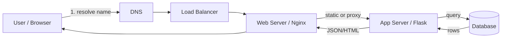

- **DNS** turns a name like `myapp.com` into an IP address.
- **Load balancer** (in production) spreads traffic across multiple web/app servers.
- **Web server / reverse proxy** serves static files and forwards API requests to the app.
- **Application server** runs your code, talks to the database, and returns JSON/HTML.
- **Database** stores and returns data.

When any of these break or slow down, the whole request fails or degrades. DevOps is about making this chain reliable, repeatable, and observable.

---

## 3. Three-Tier Architecture (Our Demo App)

Our repo uses a **three-tier** setup: one component per "tier."

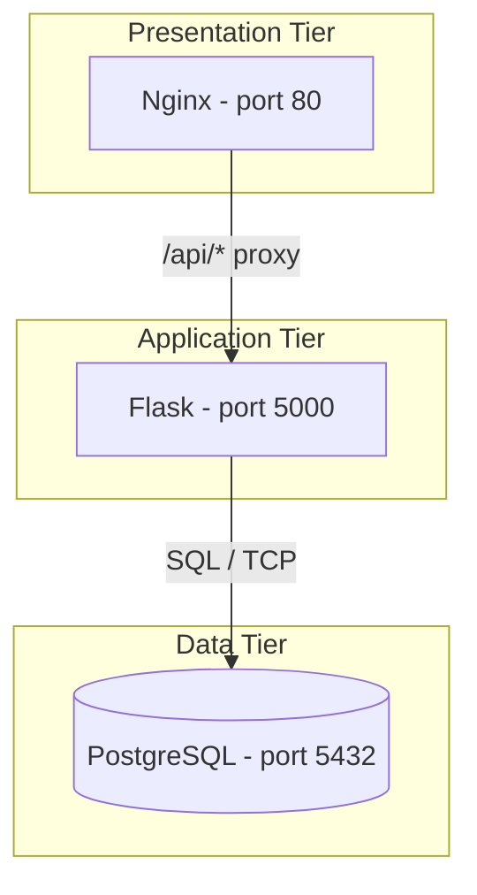

| Tier | Role | In our app | Typical PaaS / services (examples) |
|------|------|------------|-------------------------------------|
| **Presentation** | UI + static assets, reverse proxy | Nginx (HTML + proxy to API) | S3 + CloudFront, Nginx on EC2/ECS, CDN |
| **Application** | Business logic, API | Flask (Python) on port 5000 | ECS, Lambda, App Engine, Elastic Beanstalk |
| **Data** | Persistent storage | PostgreSQL | RDS, Aurora, Cloud SQL, managed Postgres |

- **Tier 1 (Frontend):** Nginx listens on **port 80**. It serves `index.html` and forwards `/api/*` to the backend.
- **Tier 2 (Backend):** Flask listens on **port 5000**. It handles `/health`, `/api/health`, `/api/items` and talks to Postgres.
- **Tier 3 (Database):** PostgreSQL listens on **port 5432**. It stores the `items` table and is initialized with `app/database/init.sql`.

In a cloud setup, each tier could be a different PaaS service (e.g. S3 for static, Lambda/ECS for app, RDS for DB), but the **roles** stay the same.

---

## 4. Protocols & Ports

### 4.1 Protocols You Need to Know

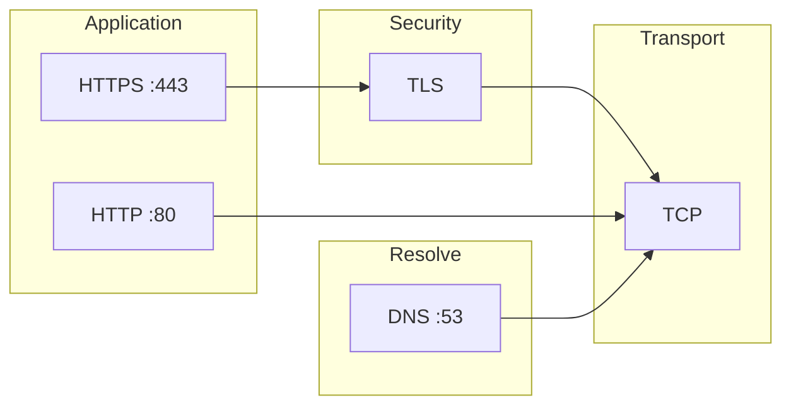

| Protocol | Layer / use | Port(s) | Where we see it |
|----------|-------------|---------|------------------|
| **HTTP** | Application | 80 | Browser ↔ Nginx; Nginx ↔ Flask (internal) |
| **HTTPS** | HTTP over TLS | 443 | Production: browser ↔ Nginx (TLS termination) |
| **TCP** | Transport | many | All of the above run over TCP; DB uses TCP |
| **TLS** | Encryption | — | HTTPS = HTTP + TLS |
| **DNS** | Resolve names to IP | 53 (UDP/TCP) | Before any HTTP: "myapp.com" → IP |

Understanding these helps when you configure load balancers, ingress, security groups, and "which port to open."

### 4.2 Ports in Our Three-Tier App

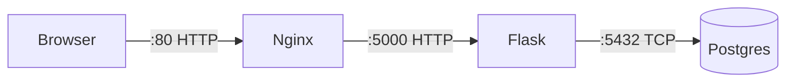

| Service | Port | Reason |
|---------|------|--------|
| Nginx | 80 | Default HTTP |
| Flask | 5000 | App listens here; Nginx proxies to `http://backend:5000` |
| PostgreSQL | 5432 | Default Postgres port |

In Kubernetes/Docker, "backend" is the backend service name; Nginx resolves it and connects to port 5000.

---

## 5. Web Server Architecture

### 5.1 What Is a Web Server?

- **Web server** = program that listens on a port (usually 80 or 443), understands HTTP/HTTPS, and either **serves files** (static content) or **forwards requests** to another server (reverse proxy).
- **Examples:** Nginx, Apache HTTP Server, Caddy. Our demo uses **Nginx**.
- **Application server** (e.g. Flask, Node, Java) runs your code and talks to the database. The web server and application server are different: the web server is the "front door"; the app server does the business logic.

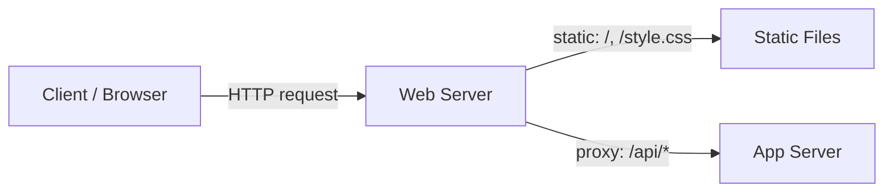

### 5.2 Two Main Jobs of a Web Server

| Job | What it does | Example |
|-----|-------------|---------|
| **Serve static content** | Return files from disk (or memory): HTML, CSS, JS, images. | `GET /` → `index.html`, `GET /style.css` → file. |
| **Reverse proxy** | Forward requests to another server (e.g. your API) and return that server's response. | `GET /api/items` → forward to `http://backend:5000/api/items`, return JSON. |

- **Reverse** = the client talks to the web server; the web server talks to the app on behalf of the client. The app server is "behind" the web server and is not directly exposed to the internet (in a typical setup).

### 5.3 How Nginx Fits (Our Demo)

- **Listen** — Nginx listens on port 80 (or 443 for HTTPS).
- **Static** — Requests for `/` or other paths are served from a root directory (e.g. `/usr/share/nginx/html`). Our `index.html` is served here.
- **Proxy** — Requests for `/api/` are sent to the **backend** (Flask on port 5000). Nginx adds headers (e.g. `Host`, `X-Real-IP`) and returns the backend's response to the client.

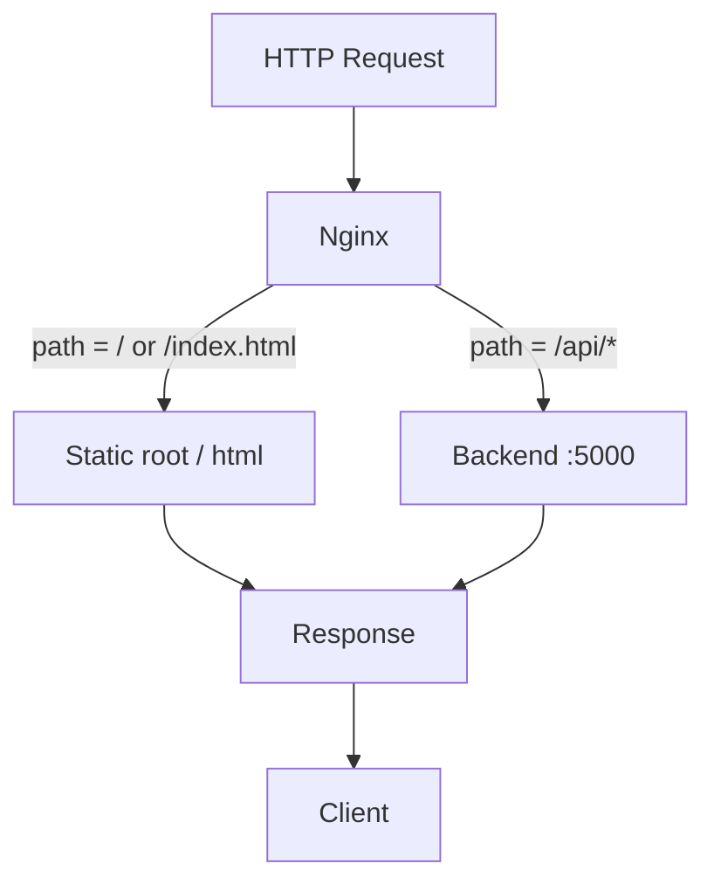

So the **web server architecture** in our app is: **one process (Nginx)** doing two things — serve static files and act as reverse proxy to the app server. In production you might add TLS termination (HTTPS) and caching at this layer too.

### 5.4 TLS Termination at the Web Server

- **HTTPS** = HTTP over TLS. Someone must decrypt the request and encrypt the response — that's **TLS termination**.
- Often the **web server** (or a load balancer in front of it) does TLS termination: it holds the certificate and private key, talks HTTPS to the client, and talks plain HTTP to the app server (inside the private network). That way the app server stays simple and only one place manages certs.

### 5.5 Web Server vs Load Balancer (Production)

- **Single server:** Client → Web server (Nginx) → App server. Nginx does static + proxy.
- **Production:** Client → **Load balancer** (ALB, NLB, or HAProxy) → **one or more web/app servers**. The load balancer distributes traffic and often does TLS; the web server (or app server directly behind LB) still does static + proxy per instance.

So **web server architecture** = one or more web server instances that handle HTTP(S), serve static content, and reverse-proxy to the application tier. DevOps cares because we deploy, scale, and monitor this layer (config, certs, logs, health checks).

### 5.6 Load Balancer Types

Not all load balancers work the same way. The type matters because it affects what protocols you can route, what you pay, and what features you get.

| Type | Works at | Examples | Routing by |
|------|----------|----------|------------|
| **Layer 4 (Transport)** | TCP/UDP | AWS NLB, HAProxy (TCP mode) | IP + port only; no HTTP awareness |
| **Layer 7 (Application)** | HTTP/HTTPS | AWS ALB, Nginx (as LB), Traefik | URL path, host header, cookies |
| **DNS-based** | DNS | Route 53, Cloudflare | DNS records; coarser control |

**For our three-tier app the relevant choice is Layer 7** — because we want to route `/api/*` differently from `/` (i.e. path-based routing), which requires HTTP awareness.

**Health checks** are a key LB feature: the LB periodically hits an endpoint (e.g. `GET /api/health`) and stops sending traffic to instances that fail. This is why Flask exposes a `/health` route.

### 5.7 Connection Pooling

Every time Flask connects to Postgres, opening a new TCP connection is expensive (3-way handshake + auth). **Connection pooling** keeps a set of connections open and reuses them:

- Flask uses SQLAlchemy which has a built-in connection pool.
- In production you might add **PgBouncer** (a dedicated Postgres connection pooler) between Flask and Postgres to handle hundreds of app instances sharing a smaller number of DB connections.
- Without pooling, a spike in traffic can exhaust Postgres's `max_connections` and cause errors.

---

## 6. Services We Use in the Three-Tier App

Concrete "services" in our stack:

| Component | Technology | Protocol / port | Purpose |
|-----------|------------|-----------------|---------|
| **Web server** | Nginx | HTTP (80) | Serve HTML; reverse-proxy `/api/*` to backend |
| **App server** | Flask (Python) | HTTP (5000) | REST API; connect to DB |
| **Database** | PostgreSQL | TCP (5432) | Store and query data |

- **Nginx** = web server + reverse proxy. In production you might put TLS termination here (HTTPS on 443).
- **Flask** = application server. It uses **HTTP** to talk to the client (and to Nginx when Nginx proxies to it).
- **PostgreSQL** = database server. Clients (our Flask app) connect over **TCP** on port 5432 using the PostgreSQL wire protocol.

So the "PaaS-like" services in our three-tier app are: **web server (Nginx), app server (Flask), database (Postgres).** In the cloud you'd swap these for managed services (e.g. ALB, ECS, RDS) but the architecture stays three-tier.

---

## 7. Caching Layer (Where It Fits)

The three-tier model is a baseline. Real production apps often add a **caching layer** to reduce load on the database and speed up responses.

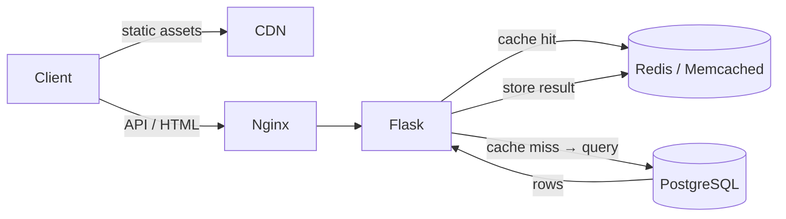

| Cache type | Where | What it caches | Example |
|------------|-------|----------------|---------|
| **CDN** | Edge / network | Static files (HTML, JS, images) | CloudFront, Cloudflare |
| **In-memory cache** | Between app and DB | DB query results, session data | Redis, Memcached |
| **HTTP cache headers** | Client / proxy | API responses (if cacheable) | `Cache-Control`, `ETag` |

**Cache invalidation** — the hard part. When data changes in the DB, stale cached values must be purged or expired (TTL). Getting this wrong means users see old data.

Our demo app doesn't include a cache (it's a learning environment), but a DevOps engineer needs to know: adding Redis means deploying and monitoring another service, managing memory limits, and handling eviction policies.

---

## 8. Frontend ↔ Backend: How API Calls Work

This section explains what happens when the browser calls an API endpoint — the request lifecycle, HTTP concepts, CORS, headers, real-time patterns, and auth. No code required; this is the conceptual model a DevOps engineer needs.

### 8.1 The Browser's Request Lifecycle

When a user opens your app and the page loads `index.html`, the JavaScript runs and immediately calls the backend to fetch data. Two separate HTTP requests happen:

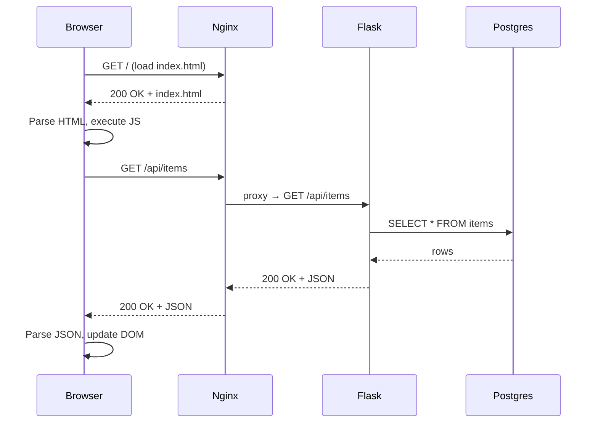

1. **Page load** — browser fetches `index.html` from Nginx (static file).
2. **Data fetch** — JavaScript makes an API call to `/api/items`; Nginx proxies it to Flask; Flask queries Postgres and returns JSON.

The browser never talks directly to Flask or Postgres. **Nginx is the single entry point.**

### 8.2 HTTP Methods and What They Mean

REST APIs use HTTP methods to signal the **intent** of the operation:

| Method | Intent | Safe? | Idempotent? | Example |
|--------|--------|-------|-------------|---------|
| `GET` | Read data | Yes | Yes | `GET /api/items` — list all items |
| `POST` | Create new resource | No | No | `POST /api/items` — add an item |
| `PUT` | Replace a resource fully | No | Yes | `PUT /api/items/1` — replace item 1 |
| `PATCH` | Partially update a resource | No | No | `PATCH /api/items/1` — update item 1's name |
| `DELETE` | Remove a resource | No | Yes | `DELETE /api/items/1` — delete item 1 |

- **Safe** = no side effects (doesn't change state). GET should never mutate data.
- **Idempotent** = calling it N times has the same effect as calling it once. DELETE is idempotent: deleting something already deleted is still "deleted."

### 8.3 HTTP Status Codes

The status code is the backend's machine-readable answer. As a DevOps engineer you'll see these in logs, dashboards, and alerts constantly.

| Code | Meaning | When you'd see it |
|------|---------|-------------------|
| `200 OK` | Success, body contains data | GET request returns items |
| `201 Created` | Resource was created | POST adds an item |
| `204 No Content` | Success, no body | DELETE succeeded |
| `400 Bad Request` | Client sent invalid data | Missing required field in POST body |
| `401 Unauthorized` | Not authenticated | No/invalid auth token |
| `403 Forbidden` | Authenticated but not allowed | User doesn't have permission |
| `404 Not Found` | Resource doesn't exist | `GET /api/items/999` where 999 doesn't exist |
| `409 Conflict` | State conflict | Inserting a duplicate unique key |
| `500 Internal Server Error` | Bug or crash in the backend | Unhandled exception in Flask |
| `502 Bad Gateway` | Nginx can't reach Flask | Flask is down or wrong port |
| `503 Service Unavailable` | Service overloaded or down | App is restarting, DB is unreachable |

**DevOps tip:** A spike in `5xx` errors in your monitoring dashboard = something is broken server-side. A spike in `4xx` = clients are sending bad requests (could be a deploy broke the API contract). Both need different responses.

### 8.4 CORS — Why It Exists and When It Bites You

**CORS (Cross-Origin Resource Sharing)** is a browser security policy. By default, a browser **blocks** JavaScript from calling an API on a different origin (different domain, port, or protocol) than the page itself.

**Origin** = scheme + host + port:
- `http://localhost` and `http://localhost:5000` are **different origins** (different port).
- `http://myapp.com` and `https://myapp.com` are **different origins** (different scheme).

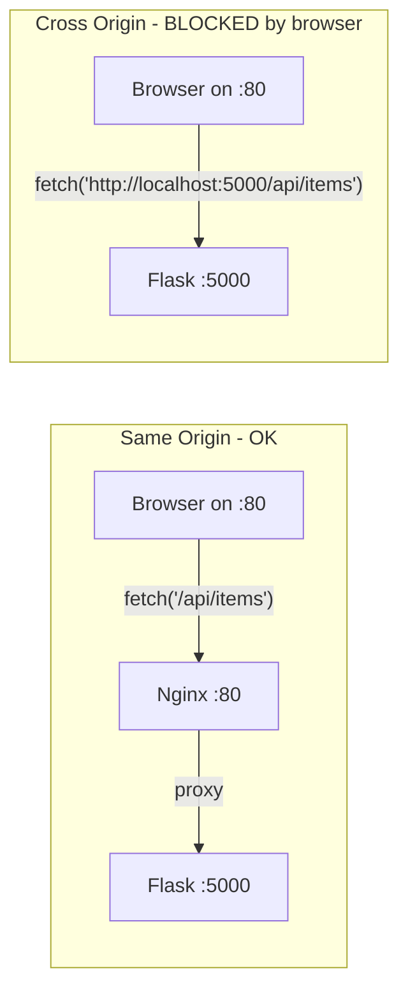

**In our demo app, CORS is not an issue** because the frontend is served by Nginx on port 80, and all API calls go to the same origin (`/api/items` on port 80). Nginx proxies them to Flask internally — the browser never sees port 5000.

**When CORS becomes a problem:**
- In development, if you run a frontend dev server on port 3000 and Flask on port 5000 separately (different origins).
- When a third-party frontend (different domain) calls your API.

The fix is adding `Access-Control-Allow-Origin` response headers in Flask (via `flask-cors`). **DevOps implication:** CORS is a config decision (which origins are allowed). It belongs in app config or environment variables, not hardcoded. Wrong CORS config is a common cause of "works locally, broken in production" bugs.

### 8.5 Request & Response Headers

HTTP requests and responses carry **headers** — key-value metadata. The most important ones for API calls:

**Request headers (browser → server):**

| Header | What it tells the server | Example |
|--------|--------------------------|---------|
| `Content-Type` | Format of the request body | `application/json` |
| `Accept` | Formats the client can handle | `application/json` |
| `Authorization` | Auth token or credentials | `Bearer <token>` |
| `X-Real-IP` | Original client IP (added by Nginx) | `203.0.113.5` |
| `Host` | Which host the client is talking to | `myapp.com` |

**Response headers (server → browser):**

| Header | What it tells the browser | Example |
|--------|---------------------------|---------|
| `Content-Type` | Format of the response body | `application/json` |
| `Content-Length` | Size of the body in bytes | `512` |
| `Cache-Control` | Whether/how long to cache the response | `no-cache`, `max-age=3600` |
| `Set-Cookie` | Set a cookie in the browser | Session tokens |
| `Access-Control-Allow-Origin` | CORS: which origins can read this | `https://myapp.com` |

Nginx adds headers when proxying (configured in `nginx.conf`):
```nginx
proxy_set_header Host $host;
proxy_set_header X-Real-IP $remote_addr;
proxy_set_header X-Forwarded-For $proxy_add_x_forwarded_for;
```
These let Flask know the original client's IP even though the request technically comes from Nginx.

### 8.6 Real-Time Communication Patterns

Standard request-response (fetch) is: client asks, server answers, connection closes. Some features need data pushed from the server (live dashboards, notifications, collaborative editing). Three main patterns:

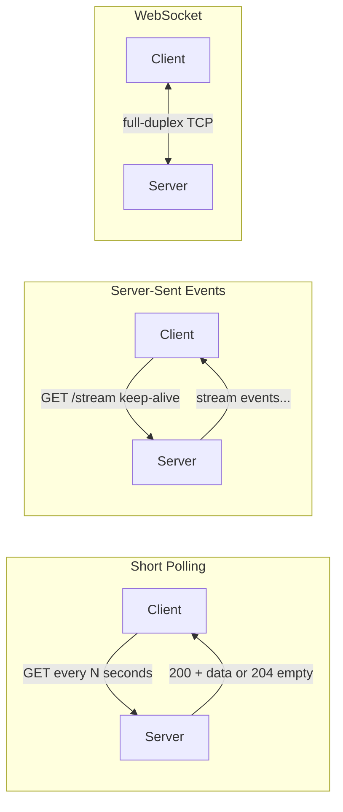

| Pattern | How it works | Good for | Drawbacks |
|---------|-------------|----------|-----------|
| **Short polling** | Client calls the API on a timer (every 5s) | Simple dashboards, low-frequency updates | Wasteful — many requests return nothing new |
| **Long polling** | Client calls API, server holds the connection open until there's new data, then responds | Chat-like features without WebSocket infra | Complex server-side; ties up connections |
| **Server-Sent Events (SSE)** | Client opens one HTTP connection; server streams events down it | Live logs, notifications, one-way data push | Server → client only |
| **WebSockets** | Client and server upgrade an HTTP connection to a persistent, full-duplex TCP channel | Live chat, collaborative tools, real-time games | More infra complexity |

**DevOps implications of real-time patterns:**
- **SSE/WebSockets** require load balancers to support long-lived connections — AWS ALB has a 60-second idle timeout by default; you need to tune it or enable WebSocket support.
- **Nginx** must be configured to disable buffering for SSE (`proxy_buffering off`).
- **Horizontal scaling** of WebSocket servers requires a shared message bus (Redis Pub/Sub, Kafka) so events from one server instance reach clients connected to another.

### 8.7 Authentication Patterns

Most real APIs require the caller to prove who they are. Two common patterns:

**1. Session cookie (stateful — server remembers the session)**

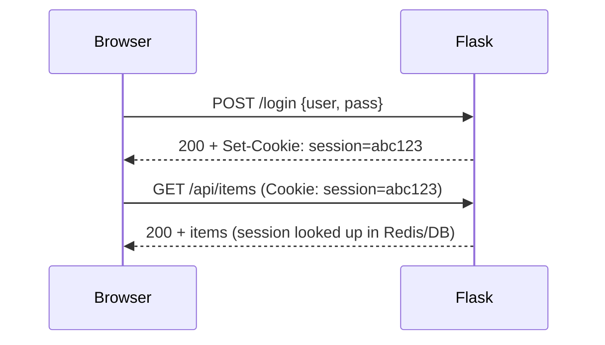
- Browser stores and sends the cookie automatically on every request.
- Flask looks up the session ID in a server-side store (often Redis).
- **DevOps implication:** Requires a session store (Redis) as another service to deploy and monitor. Load balancer may need **sticky sessions** so a user's requests always hit the same app instance.

**2. JWT — stateless (server verifies a signed token)**

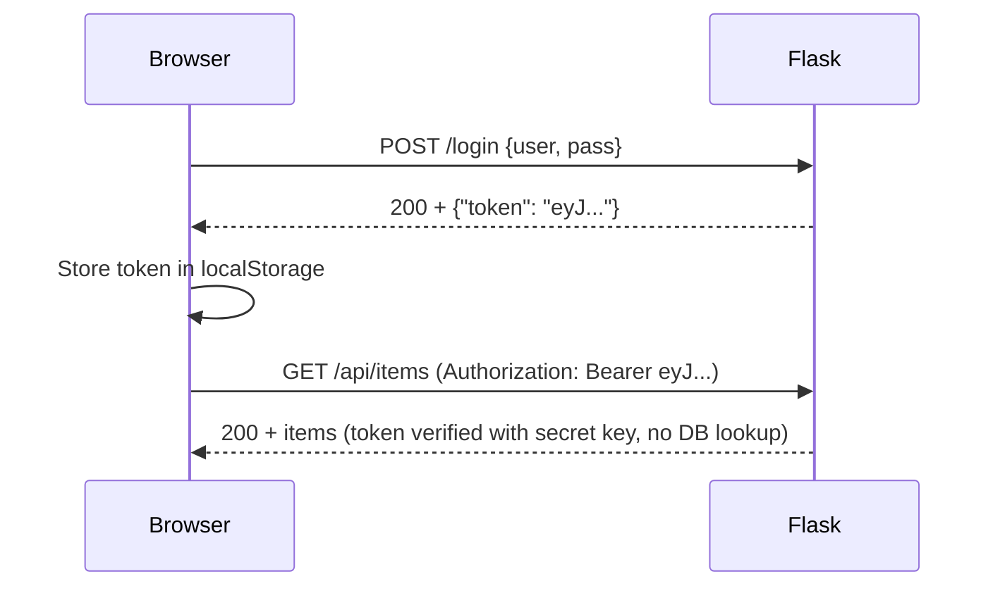
- Token is self-contained (signed, contains user info). No server-side session store needed.
- **DevOps implication:** No sticky sessions needed — any app instance can verify the token. Secret key used to sign JWTs must come from an environment variable or secrets manager, never hardcoded.

### 8.8 Full Request Trace — Putting It All Together

Here is the complete picture for a user clicking "Add item" in the browser:

```
1.  User clicks "Add" button
2.  JS runs: POST /api/items with body {"name": "Widget"}
3.  Browser resolves /api/items → http://localhost:80/api/items (same origin)
4.  Browser opens TCP connection to Nginx on port 80 (or reuses keep-alive)
5.  Browser sends HTTP request:
      POST /api/items HTTP/1.1
      Host: localhost
      Content-Type: application/json
      Content-Length: 18
      {"name": "Widget"}
6.  Nginx receives request, matches location /api/ → proxy_pass http://backend:5000
7.  Nginx opens TCP connection to Flask on port 5000 (inside Docker network)
8.  Nginx forwards request + adds X-Real-IP, X-Forwarded-For headers
9.  Flask receives request, routes to add_item()
10. Flask gets a DB connection from the SQLAlchemy connection pool
11. Flask executes: INSERT INTO items (name) VALUES ('Widget') RETURNING id;
12. Postgres inserts row, returns id=42
13. Flask commits transaction, returns {"id": 42, "name": "Widget"} with status 201
14. Nginx receives Flask's response, forwards it to the browser
15. Browser receives 201 + JSON
16. JS parses JSON, appends new item to the list in the DOM
17. User sees "Widget" appear on screen
```

Every one of these 17 steps is a potential failure point. Every one of these steps is something DevOps monitors, scales, and secures.

---

## 9. Common Failure Points (Per Tier)

Knowing the layers tells you **where to look when something breaks**. Here are the most common failures at each tier and how to investigate:

| Tier | Symptom | Likely cause | Where to look |
|------|---------|--------------|---------------|
| **DNS** | Can't reach the app at all | DNS misconfiguration, TTL not propagated | `dig myapp.com`, check registrar/Route 53 |
| **Web server (Nginx)** | 502 Bad Gateway | Nginx can't reach Flask (wrong host/port, Flask is down) | Nginx error logs, `curl http://backend:5000/health` from inside the container |
| **Web server (Nginx)** | 404 Not Found | Path not matched in Nginx config | Check `nginx.conf` — is `/api/` proxied? Is `/` serving the right root? |
| **App server (Flask)** | 500 Internal Server Error | Exception in Python code or DB error | Flask logs / stdout |
| **App server (Flask)** | Slow responses | DB query taking too long, missing index, connection pool exhausted | Query times in Flask logs, DB slow query log |
| **Database (Postgres)** | `connection refused` | Postgres not running, wrong port, firewall rule | `pg_isready`, check port 5432 is open, check container/service status |
| **Database (Postgres)** | `too many connections` | Connection pool not configured, traffic spike | PgBouncer, reduce `max_connections` per app instance |
| **TLS / HTTPS** | `SSL_ERROR_RX_RECORD_TOO_LONG` | Nginx not configured for HTTPS but client is sending HTTPS | Check `listen 443 ssl` and cert config in Nginx |

**General debugging approach:**
1. Start at the **client** — what does the browser/curl see? (HTTP status code, error message)
2. Move **inward** — check Nginx logs, then Flask logs, then Postgres logs.
3. **Isolate** each hop with `curl` to confirm which service is actually failing.

---

## 10. Dev vs Production Differences

The same three-tier architecture looks different across environments. Understanding this matters for DevOps because you're managing all of them.

| Aspect | Dev (local) | Production |
|--------|-------------|------------|
| **TLS** | Plain HTTP (no cert) | HTTPS (TLS termination at Nginx or LB) |
| **Load balancing** | Not needed (single instance) | LB in front, multiple app server instances |
| **Database** | Local Postgres in Docker | Managed DB (RDS, Cloud SQL), automated backups, replicas |
| **Secrets** | `.env` file | Secrets manager (AWS Secrets Manager, Vault, k8s Secrets) |
| **Logging** | `stdout` / console | Centralized log aggregation (CloudWatch, Datadog, ELK) |
| **Scaling** | Single container/process | Auto-scaling groups, container orchestration (ECS, k8s) |
| **Static assets** | Served by Nginx directly | CDN (CloudFront, Cloudflare) in front |

A common mistake is building for dev and being surprised by production differences. For example:
- **Secrets in `.env` files** work locally but should never go to production — use a secrets manager.
- **Single-instance DB** works locally but in production you need read replicas, backups, and failover.
- **`DEBUG=True` in Flask** is fine locally but exposes stack traces in production — always set `DEBUG=False`.

---

## 11. How This Leads to DevOps

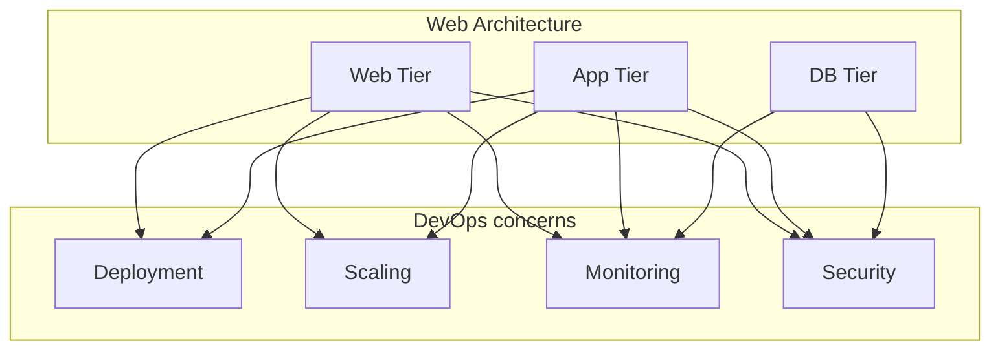

Once you see the flow and the tiers: **Deployment** (ship code to app tier), **Scaling** (web + app + DB replicas), **Monitoring** (logs, metrics, alerts per tier), **Security** (ports, TLS, secrets). **Web architecture + protocols + services = the "what" we operate. DevOps is the "how" we build, deploy, and run it reliably.**

---

## 12. Quick Recap

- **Request flow:** User → DNS → (LB) → Web server → App server → Database → back.
- **Three tiers:** Nginx (presentation), Flask (application), Postgres (data). Each tier has its own port, config, scaling, and failure modes.
- **Protocols:** HTTP/HTTPS, TCP, TLS, DNS. **Ports:** 80 (Nginx), 5000 (Flask), 5432 (Postgres).
- **Web server (Nginx):** Serves static files + reverse-proxies `/api/*` to Flask. TLS termination happens here.
- **Load balancer:** Layer 7 for path-based routing. Runs health checks against `/health` to remove failed instances.
- **Caching:** CDN for static assets, Redis for DB query results. Cache invalidation is the hard part.
- **API calls:** Browser → Nginx (same origin) → Flask (route match) → Postgres (SQL) → JSON → DOM update.
- **HTTP methods:** GET (read), POST (create), PUT/PATCH (update), DELETE (remove). Status codes tell you what happened.
- **CORS:** Only a problem when frontend and API are on different origins. Nginx proxy eliminates it in our setup.
- **Real-time:** Polling (simple), SSE (server-push), WebSockets (full-duplex). Each has LB and scaling implications.
- **Auth:** Session cookies (stateful, need Redis + sticky sessions) vs JWT (stateless, need secret key in env).
- **Dev vs prod:** `.env` → secrets manager, `stdout` → log aggregation, single instance → autoscaling, HTTP → HTTPS.

---

**Day 1 | Sheet 1** — *Ref: `app/frontend/`, `app/backend/`, `app/database/`*
