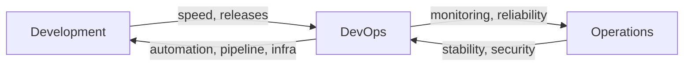
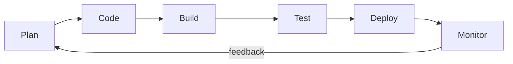
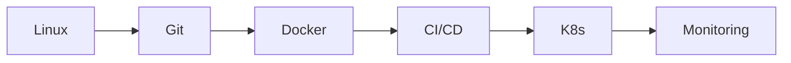

# Day 2 — DevOps Reality & Industry Overview

**Sheet 2**

What DevOps actually is, why the role exists, and how it fits into the toolchain.

---

## 1. What Is DevOps?

- **Culture + automation:** Breaking the wall between Dev (ship fast) and Ops (keep stable). DevOps is the bridge.
- **Reality vs buzzword:** It’s not “just Jenkins” or “just DevOps tools” — it’s how we build, ship, and run software reliably together.

---

## 2. SDLC vs DevOps Lifecycle

- **SDLC:** Plan → Build → Test → Deploy (often handoffs, delays, blame).
- **DevOps:** Same phases but **continuous** — small batches, automation, feedback from production.

---

## 3. Dev Pain vs Ops Pain

| Dev wants | Ops wants |
|-----------|------------|
| Fast releases, less wait | Controlled, safe releases |
| Automate everything | Don’t break production |
| CI/CD, experiments | Stability, rollback, monitoring |

**DevOps** aligns both: automation with safety, speed with observability.

---

## 4. Why Companies Hire DevOps

- **Reliability:** Fewer outages, faster recovery.
- **Speed:** Ship often without chaos.
- **Cost:** Less manual work, better resource use (containers, scaling).
- **Security:** Infra as code, secrets management, least privilege.

---

## 5. Toolchain Overview

- **Linux** — base for servers and containers.
- **Git** — version control and collaboration.
- **Docker** — consistent runtimes (containers).
- **CI/CD** — build, test, deploy automatically.
- **Kubernetes** — run and scale containers.
- **Monitoring** — logs, metrics, alerts.

---

## 6. Quick Recap

- DevOps = bridge between Dev and Ops; culture + automation.
- Lifecycle is continuous: code → build → test → deploy → monitor → feedback.
- Toolchain: Linux → Git → Docker → CI/CD → K8s → Monitoring.
- Share one real production story from your experience in the session.

---

**Day 2 | Sheet 2**
