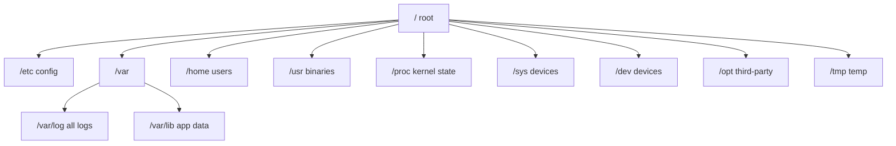
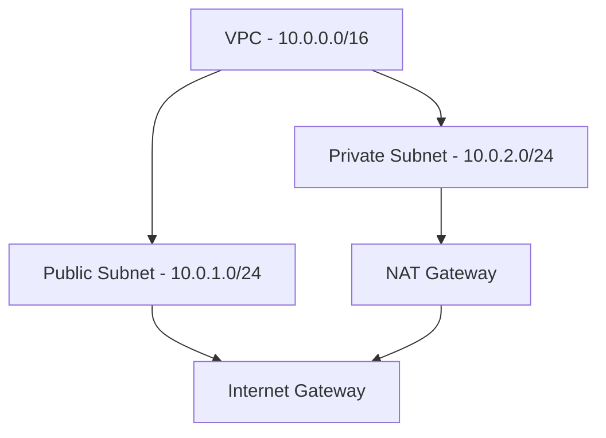

# Day 3 — Linux Essentials for DevOps / SRE / Cloud Engineering

**Sheet 3**

> **Goal of this sheet:** Everything a DevOps or SRE engineer picks up over 4 years on the job — compressed into one reference. Linux is not optional in this field. It is the floor every other tool sits on.

---

## Why Linux? The Honest Answer

Every server you will ever manage in production runs Linux. Every Docker container runs a Linux kernel underneath. Every Kubernetes node is a Linux machine. Every EC2 instance, GCP VM, Azure VM defaults to Linux. Jenkins runs on Linux. Nginx runs on Linux. PostgreSQL runs on Linux.

When a service goes down at 2 AM, you are not clicking around a GUI. You are SSH'd into a machine, reading logs, checking processes, inspecting network connections, and either fixing it or escalating with enough context for someone else to fix it. That is why Linux matters.

| Role | Why Linux Depth Matters |
|------|------------------------|
| **DevOps Engineer** | CI/CD agents, Docker hosts, Kubernetes nodes, deployment scripts all live on Linux |
| **SRE** | Incident response, performance debugging, log analysis, on-call — all done on Linux |
| **Cloud Engineer** | Every cloud resource you manage (EC2, EKS, ECS) runs Linux; Terraform runs on Linux |
| **Platform Engineer** | Cluster node tuning, kernel parameters, cgroup limits — unavoidable |

---

## 1. The File System — Know Where Everything Lives

Linux has one tree. Everything hangs off `/`. No drive letters. Know this layout cold.

| Path | What Lives Here | Why You Care |
|------|----------------|--------------|
| `/` | Root of everything | Start of all paths |
| `/etc` | System and app config files | nginx.conf, sshd_config, cron, resolv.dns |
| `/var/log` | All logs | Where you go first when something breaks |
| `/home` | User home directories | Developer accounts, SSH keys |
| `/root` | Root user's home | Separate from /home on purpose |
| `/tmp` | Temporary files; wiped on reboot | Staging area, throwaway scripts |
| `/usr/bin` | User-installed binaries | kubectl, docker, terraform live here |
| `/usr/local/bin` | Manually installed binaries | Your custom scripts, language runtimes |
| `/opt` | Third-party software | Jenkins, custom agents often here |
| `/proc` | Virtual filesystem — live kernel state | CPU, memory, process info at runtime |
| `/sys` | Virtual filesystem — kernel devices/config | Hardware, cgroups, kernel tuning |
| `/dev` | Device files | Disks (/dev/sda), terminals, /dev/null |
| `/mnt` and `/media` | Mount points | External volumes, EBS disks |
| `/run` | Runtime data (PIDs, sockets) | Systemd, Docker socket |



**Production habits:**
- Config always in `/etc`. App data in `/var/lib`. Logs in `/var/log`.
- Never write scripts to `/tmp` in production — it gets wiped.
- `/proc/meminfo`, `/proc/cpuinfo` — readable files that show live system state.

---

## 2. Permissions — chmod, chown, and Why They Matter in Production

Every file has an owner, a group, and permission bits for three audiences: **owner**, **group**, **others**.

```
-rwxr-xr--  1  appuser  appgroup  4096  Mar 10  server.py
 |||||||||||
 |└──┬──┘└──┬──┘└──┬──┘
 |  owner  group  others
 └── file type (- = file, d = dir, l = symlink)
```

| Symbol | Octal | Meaning |
|--------|-------|---------|
| `r` | 4 | Read |
| `w` | 2 | Write |
| `x` | 1 | Execute (or traverse directory) |

**Common permission patterns:**
```bash
chmod 755 script.sh        # owner: rwx, group: r-x, others: r-x (standard for executables)
chmod 644 config.conf      # owner: rw-, group: r--, others: r-- (standard for config files)
chmod 600 ~/.ssh/id_rsa    # owner: rw-, nobody else (SSH private key — must be this)
chmod 700 ~/.ssh           # owner only can enter (SSH dir requirement)
chmod 000 secret.txt       # nobody can read — not even root? No — root bypasses permissions
chmod +x deploy.sh         # add execute for everyone
chmod -R 755 /opt/app      # recursive on a directory
```

**chown — change ownership:**
```bash
chown appuser file.txt
chown appuser:appgroup file.txt
chown -R appuser:appgroup /opt/app   # recursive
```

**Why this bites you in production:**
- SSH won't connect → `~/.ssh/authorized_keys` has wrong permissions (must be 600)
- App can't read its config → file owned by root, running as appuser
- Script won't execute → missing `+x`
- Docker volume mounts with wrong UID → container writes fail

**Special bits (know these exist):**
| Bit | Effect |
|-----|--------|
| `setuid (4xxx)` | File runs as its owner, not the caller. `/usr/bin/sudo` uses this. |
| `setgid (2xxx)` | File runs as its group. New files in dir inherit group. |
| `sticky (1xxx)` | Only owner can delete their own files. `/tmp` uses this (chmod 1777). |

---

## 3. Users, Groups, and Service Accounts

**Commands:**
```bash
id                          # your UID, GID, groups
whoami                      # current user
groups                      # groups you belong to
useradd -m -s /bin/bash appuser    # create user with home and shell
usermod -aG docker appuser  # add user to docker group (no -a = removes from others)
passwd appuser              # set password
userdel -r appuser          # delete user and home dir
cat /etc/passwd             # all users (UID:GID:home:shell)
cat /etc/shadow             # hashed passwords (root only)
cat /etc/group              # all groups
```

**sudo — running as root:**
```bash
sudo command                # run one command as root
sudo -i                     # full root shell (use carefully)
sudo -u postgres psql       # run as a different user (not root)
visudo                      # safely edit /etc/sudoers
```

**The sudoers file pattern:**
```
appuser ALL=(ALL) NOPASSWD: /usr/bin/systemctl restart nginx
# user  host=(run_as) options: commands_allowed
```

**Service accounts — the DevOps pattern:**
- Never run apps as root. Create a dedicated user: `useradd -r -s /sbin/nologin appuser`
- `-r` = system account (low UID, no home), `-s /sbin/nologin` = can't log in interactively
- Systemd unit files specify `User=appuser` and `Group=appgroup`
- This is how nginx, postgres, jenkins all run — as their own users, not root

---

## 4. Process Management — What's Running and Why

**Viewing processes:**
```bash
ps aux                      # all processes, all users, detailed
ps aux | grep nginx         # find nginx processes
ps -ef --forest             # tree view showing parent-child relationships
top                         # live view (press M=sort by memory, P=CPU, q=quit)
htop                        # better top (install separately)
pgrep nginx                 # get PID of nginx
pidof nginx                 # same
```

**Signals — how to stop processes:**
```bash
kill 1234                   # SIGTERM (15) — polite shutdown, app can clean up
kill -9 1234                # SIGKILL — force kill, no cleanup, use as last resort
kill -HUP 1234              # SIGHUP — reload config (nginx, sshd honor this)
killall nginx               # kill all processes named nginx
pkill -f "python app.py"    # kill by matching command string
```

**Why kill -9 is a last resort:** The process can't clean up — temp files stay, connections hang, data may corrupt. Always try SIGTERM first and wait a few seconds.

**nice and renice — process priority:**
```bash
nice -n 10 python batch.py  # start with lower priority (-20=highest, 19=lowest)
renice -n 15 -p 1234        # change priority of running process
```

**Background jobs:**
```bash
command &                   # run in background
jobs                        # list background jobs
fg %1                       # bring job 1 to foreground
nohup command &             # run immune to hangup (survives terminal close)
disown %1                   # detach job from shell
```

---

## 5. Systemd — How Production Services Are Managed

In modern Linux (Ubuntu 16+, RHEL 7+, Amazon Linux 2+), systemd manages everything. Know this well.

```bash
systemctl status nginx           # is it running? last few log lines
systemctl start nginx            # start
systemctl stop nginx             # stop
systemctl restart nginx          # stop + start (downtime)
systemctl reload nginx           # reload config without downtime (if app supports it)
systemctl enable nginx           # start on boot
systemctl disable nginx          # don't start on boot
systemctl is-active nginx        # exits 0 if active, useful in scripts
systemctl list-units --type=service --state=running   # all running services
```

**Reading a unit file:**
```bash
systemctl cat nginx              # show the unit file
cat /etc/systemd/system/myapp.service
```

**A basic unit file for your own app:**
```ini
[Unit]
Description=My Flask App
After=network.target

[Service]
User=appuser
Group=appgroup
WorkingDirectory=/opt/myapp
ExecStart=/opt/myapp/venv/bin/python app.py
Restart=always
RestartSec=5
StandardOutput=journal
StandardError=journal

[Install]
WantedBy=multi-user.target
```

**journalctl — reading systemd logs:**
```bash
journalctl -u nginx                     # all logs for nginx
journalctl -u nginx -f                  # follow (like tail -f)
journalctl -u nginx --since "1 hour ago"
journalctl -u nginx -n 100              # last 100 lines
journalctl -p err -u nginx              # only errors
journalctl --disk-usage                 # how much space logs are using
journalctl --vacuum-time=7d             # delete logs older than 7 days
```

---

## 6. Logs — The First Place You Go When Things Break

**Key log files:**
| File | What's In It |
|------|-------------|
| `/var/log/syslog` or `/var/log/messages` | General system messages |
| `/var/log/auth.log` or `/var/log/secure` | SSH logins, sudo, auth failures |
| `/var/log/kern.log` | Kernel messages (OOM killer, hardware errors) |
| `/var/log/dmesg` | Boot and hardware messages |
| `/var/log/nginx/access.log` | Every HTTP request |
| `/var/log/nginx/error.log` | Nginx errors |
| `/var/log/apt/` or `/var/log/yum.log` | Package installs |

**Reading logs:**
```bash
tail -f /var/log/nginx/error.log          # follow in real time
tail -100 /var/log/syslog                 # last 100 lines
grep "ERROR" /var/log/app.log             # filter for errors
grep -i "out of memory" /var/log/kern.log # case insensitive
zcat /var/log/syslog.2.gz | grep ERROR    # read compressed rotated log
```

**Searching across multiple log files:**
```bash
grep -r "connection refused" /var/log/
grep -l "ERROR" /var/log/*.log            # which files contain ERROR
```

**logrotate** — logs get rotated automatically. Config in `/etc/logrotate.d/`. If a log file is huge, check if logrotate is configured for it. In containers, logs go to stdout/stderr — journald or a log driver collects them.

---

## 7. Networking Commands — Diagnosing Connectivity on Any Machine

**Ports and sockets:**
```bash
ss -tlnp                    # TCP listening ports with process names (modern, prefer over netstat)
ss -tunp                    # TCP + UDP, listening + established
netstat -tlnp               # older equivalent (may not be installed)
lsof -i :8080               # what process is using port 8080
lsof -i tcp                 # all open TCP connections
```

**Testing connectivity:**
```bash
curl -v http://localhost:8080/health      # verbose HTTP — shows headers, SSL, timing
curl -o /dev/null -s -w "%{http_code}\n" http://example.com   # just print status code
wget -q -O- http://localhost/            # download to stdout
nc -zv hostname 5432                     # check if port is open (TCP connect test)
telnet hostname 5432                     # older equivalent
```

**DNS:**
```bash
dig google.com                           # full DNS query with timing
dig @8.8.8.8 google.com                 # query specific DNS server
nslookup google.com                      # simpler DNS lookup
cat /etc/resolv.conf                     # your DNS server config
cat /etc/hosts                           # local hostname overrides
```

**Routing and interfaces:**
```bash
ip addr                     # all network interfaces and IPs (modern, replaces ifconfig)
ip route                    # routing table
ip route get 8.8.8.8        # which interface/gateway does this IP use?
traceroute google.com        # hop-by-hop path to destination
mtr google.com              # live traceroute (install mtr)
ping -c 4 google.com         # basic reachability check
```

**Packet capture — the SRE superpower:**
```bash
tcpdump -i eth0 port 80                  # capture HTTP on eth0
tcpdump -i any host 10.0.1.5            # all traffic to/from an IP
tcpdump -i eth0 -w capture.pcap         # write to file, open in Wireshark
tcpdump -i eth0 port 5432 -A            # show ASCII payload (DB queries in plaintext)
```

---

## 8. File Operations — Power Tools You Use Every Day

**Finding files:**
```bash
find /etc -name "*.conf"                 # find all .conf files
find /var/log -name "*.log" -mtime -1   # logs modified in last 1 day
find /opt -name "*.py" -size +1M         # Python files over 1MB
find / -user root -perm -4000 2>/dev/null  # find setuid files (security audit)
```

**Text processing (grep, awk, sed):**
```bash
# grep
grep -n "ERROR" app.log                 # show line numbers
grep -v "DEBUG" app.log                 # exclude lines with DEBUG
grep -A 3 -B 3 "exception" app.log      # 3 lines before and after match
grep -E "error|warn|fatal" app.log      # regex — multiple patterns

# awk — column extraction
ps aux | awk '{print $1, $2, $11}'      # print user, PID, command
df -h | awk 'NR>1 {print $5, $6}'      # disk usage: skip header, print usage% and mount
awk -F: '{print $1}' /etc/passwd        # print all usernames (: is delimiter)
cat app.log | awk '{sum += $NF} END {print sum}'  # sum last column

# sed — in-place editing
sed -i 's/old_value/new_value/g' config.conf   # replace in file
sed -n '10,20p' file.txt               # print lines 10–20
sed '/^#/d' config.conf               # delete comment lines
```

**Archiving and compression:**
```bash
tar -czf archive.tar.gz /opt/app       # create gzipped tar
tar -xzf archive.tar.gz                # extract
tar -tzf archive.tar.gz                # list contents without extracting
zip -r app.zip /opt/app
unzip app.zip
```

**Copying files:**
```bash
cp -r /source /dest                    # recursive copy
rsync -avz /source/ user@host:/dest/   # sync (only copies changes, preserves permissions)
rsync -avz --delete /source/ /dest/    # sync and delete extras in dest
scp file.txt user@host:/path/          # secure copy over SSH
```

---

## 9. Storage — Disks, Mounts, and Disk Space

**Disk usage:**
```bash
df -h                                  # disk usage per filesystem (human readable)
df -h /var/log                         # just for one path
du -sh /var/log/*                      # size of each item in /var/log
du -sh * | sort -rh | head -10         # top 10 largest items in current dir
```

**Disks and partitions:**
```bash
lsblk                                  # block devices (disks, partitions) — use this first
fdisk -l                               # partition table detail (needs root)
blkid                                  # UUID and filesystem type per device
```

**Mounting:**
```bash
mount /dev/xvdb1 /data                 # mount a partition
mount -t nfs 10.0.1.5:/share /mnt/nfs  # mount NFS
umount /data
cat /proc/mounts                       # all currently mounted filesystems
```

**Making a mount persistent — /etc/fstab:**
```
/dev/xvdb1  /data  ext4  defaults  0  2
UUID=xxxx   /data  ext4  defaults  0  2   # prefer UUID over device name
```

**Filesystem operations:**
```bash
mkfs.ext4 /dev/xvdb1                  # format (DESTRUCTIVE — double check device)
fsck /dev/xvdb1                        # filesystem check (unmounted only)
tune2fs -l /dev/xvdb1                  # show filesystem info
```

**Why this matters:** EBS volumes on EC2, persistent volumes in Kubernetes, NFS mounts for shared storage — all of this is just Linux mount management.

---

## 10. Performance Debugging — When the System Is Slow

**The four resource areas to check: CPU, Memory, Disk I/O, Network**

**CPU:**
```bash
top                         # overall; press P to sort by CPU
mpstat -P ALL 1             # per-CPU utilization every 1s
vmstat 1 5                  # system-wide CPU, memory, I/O snapshot every 1s
uptime                      # load average (1m, 5m, 15m) — rule: load > CPU count = saturated
```

**Memory:**
```bash
free -h                     # RAM and swap (used/free/available)
cat /proc/meminfo           # detailed memory breakdown
vmstat 1 5                  # includes swap activity
```

**OOM Killer** — when RAM is exhausted, the kernel kills processes. Look for it:
```bash
grep -i "oom" /var/log/syslog
grep -i "killed process" /var/log/kern.log
dmesg | grep -i "out of memory"
```

**Disk I/O:**
```bash
iostat -x 1                 # disk I/O utilization per device, every 1s
iotop                       # which process is doing I/O (like top for disk)
lsof +D /var/log            # what processes have files open in /var/log
```

**Combining — a quick system snapshot:**
```bash
vmstat 1 5     # overall: r (run queue), b (blocked), si/so (swap in/out), bi/bo (block I/O)
iostat -x 1 3  # disk: %util near 100% = disk saturated
free -h        # if available ≈ 0, system is swapping heavily
ss -s          # socket summary: many TIME_WAIT or CLOSE_WAIT = connection backlog
```

**strace — what system calls is a process making:**
```bash
strace -p 1234              # attach to running process
strace -e trace=network -p 1234   # only show network calls
strace -c command           # run command, show syscall summary
```

**lsof — open files:**
```bash
lsof -p 1234                # all files/sockets open by PID 1234
lsof -i :5432               # what's connected to port 5432
lsof /var/log/app.log       # who has this file open (needed before log rotation)
```

---

## 11. Shell Scripting — Automation Fundamentals

Every DevOps engineer writes bash scripts. Know the patterns.

**Script skeleton:**
```bash
#!/usr/bin/env bash
set -euo pipefail           # e=exit on error, u=unset var is error, o pipefail=pipe errors caught

ENVIRONMENT="${1:-dev}"     # first arg, default "dev"
LOG_FILE="/var/log/deploy.log"

log() {
  echo "[$(date '+%Y-%m-%d %H:%M:%S')] $*" | tee -a "$LOG_FILE"
}

if [[ "$ENVIRONMENT" != "dev" && "$ENVIRONMENT" != "prod" ]]; then
  echo "Usage: $0 [dev|prod]" >&2
  exit 1
fi

log "Starting deploy to $ENVIRONMENT"
```

**Conditionals:**
```bash
if [[ -f /etc/nginx/nginx.conf ]]; then echo "exists"; fi
if [[ -d /opt/app ]]; then echo "dir exists"; fi
if [[ -z "$VAR" ]]; then echo "empty"; fi
if [[ -n "$VAR" ]]; then echo "not empty"; fi
if [[ "$a" == "$b" ]]; then echo "equal"; fi
if [[ "$a" -gt 10 ]]; then echo "greater than 10"; fi  # numeric
```

**Loops:**
```bash
for service in nginx postgresql redis; do
  systemctl restart "$service"
done

while ! nc -z localhost 5432; do
  echo "waiting for postgres..."
  sleep 2
done
```

**Functions:**
```bash
wait_for_port() {
  local host="$1"
  local port="$2"
  local timeout="${3:-60}"
  local start=$SECONDS
  until nc -z "$host" "$port"; do
    [[ $((SECONDS - start)) -ge $timeout ]] && { echo "timeout"; return 1; }
    sleep 2
  done
}

wait_for_port localhost 5432 30
```

**Useful patterns:**
```bash
# Check if command exists
command -v docker &>/dev/null || { echo "docker not installed"; exit 1; }

# Retry logic
for i in {1..5}; do
  curl -f http://localhost/health && break
  sleep 5
done

# Trap — cleanup on exit
cleanup() { rm -f /tmp/lockfile; }
trap cleanup EXIT

# Read a file line by line
while IFS= read -r line; do
  echo "Processing: $line"
done < servers.txt
```

---

## 12. SSH — The Daily Driver for Remote Access

```bash
ssh user@host                           # basic connect
ssh -i ~/.ssh/mykey.pem user@host       # with specific key
ssh -p 2222 user@host                   # custom port
ssh -v user@host                        # verbose (debug connection issues)
ssh -A user@host                        # forward your SSH agent (for hopping)
ssh -L 5432:localhost:5432 user@host    # local port forward (tunnel DB to your machine)
ssh -R 8080:localhost:8080 user@host    # reverse tunnel
```

**SSH config file — stop typing long commands:**
```
# ~/.ssh/config
Host bastion
  HostName 1.2.3.4
  User ec2-user
  IdentityFile ~/.ssh/prod.pem
  ForwardAgent yes

Host prod-db
  HostName 10.0.2.50
  User ubuntu
  IdentityFile ~/.ssh/prod.pem
  ProxyJump bastion          # jump through bastion automatically
```

Now `ssh prod-db` connects through the bastion in one command.

**Key management:**
```bash
ssh-keygen -t ed25519 -C "your@email.com"   # generate keypair (ed25519 is modern)
ssh-copy-id user@host                         # copy public key to remote authorized_keys
cat ~/.ssh/id_ed25519.pub >> ~/.ssh/authorized_keys  # manual way
chmod 700 ~/.ssh && chmod 600 ~/.ssh/authorized_keys  # must be this
```

**Troubleshooting SSH:**
```bash
ssh -vvv user@host                      # very verbose — shows exact failure point
tail -f /var/log/auth.log               # server-side auth log
systemctl status sshd                   # is SSH daemon running?
sshd -T | grep passwordauthentication   # check if password auth is on/off
```

---

## 13. Cron — Scheduling Jobs

```bash
crontab -e          # edit your crontab
crontab -l          # list
crontab -r          # remove all (careful)
crontab -u appuser -e   # edit another user's crontab
```

**Cron syntax:**
```
┌──────────── minute (0-59)
│  ┌─────────── hour (0-23)
│  │  ┌────────── day of month (1-31)
│  │  │  ┌───────── month (1-12)
│  │  │  │  ┌──────── day of week (0-7, 0 and 7 = Sunday)
│  │  │  │  │
*  *  *  *  *  command

0 2 * * *    /opt/scripts/backup.sh         # 2 AM daily
*/5 * * * *  /opt/scripts/health-check.sh   # every 5 minutes
0 */6 * * *  /opt/scripts/cleanup.sh        # every 6 hours
0 0 * * 1    /opt/scripts/weekly.sh         # midnight every Monday
```

**System cron directories — no crontab needed:**
```bash
/etc/cron.hourly/    # drop a script here → runs every hour
/etc/cron.daily/     # daily
/etc/cron.weekly/    # weekly
```

**Logging cron output:**
```bash
0 2 * * * /opt/backup.sh >> /var/log/backup.log 2>&1
```

---

## 14. Kernel Tuning — What a Senior Engineer Knows

These are the parameters that matter in production. You won't touch them often, but you'll recognize them when you need to.

**sysctl — view and change kernel parameters:**
```bash
sysctl -a                           # all parameters
sysctl net.core.somaxconn           # check one value
sysctl -w net.core.somaxconn=65535  # set at runtime (resets on reboot)
```

**Make persistent in `/etc/sysctl.d/99-custom.conf`:**
```
# Allow more connections to be queued
net.core.somaxconn = 65535

# Reuse TIME_WAIT sockets (high-traffic APIs)
net.ipv4.tcp_tw_reuse = 1

# Increase local port range (more outbound connections)
net.ipv4.ip_local_port_range = 1024 65535

# Disable IPv6 if not needed
net.ipv6.conf.all.disable_ipv6 = 1

# Allow non-root to bind low ports (useful for containers)
net.ipv4.ip_unprivileged_port_start = 80

# VM memory overcommit (set for Redis per their docs)
vm.overcommit_memory = 1

# Disable transparent huge pages warning (Redis, MongoDB)
vm.nr_hugepages = 0
```

**Apply without reboot:**
```bash
sysctl -p /etc/sysctl.d/99-custom.conf
```

**ulimits — per-process limits:**
```bash
ulimit -n                       # max open files for current shell
ulimit -n 65535                 # set for current shell
```

**Systemd service ulimit:**
```ini
[Service]
LimitNOFILE=65535               # open files
LimitNPROC=4096                 # processes
```

**Why this matters:** Nginx, Node.js, Java apps — all hit open file limits under load. The default (1024) is too low for any production service.

---

## 15. Linux + Containers — What Docker Actually Uses

Docker is not magic. It is Linux kernel features with a nice CLI.

| Linux Feature | What Docker Uses It For |
|--------------|------------------------|
| **Namespaces** | Isolate PID, network, filesystem, user per container |
| **cgroups** | Limit CPU and memory per container |
| **Union filesystem (overlay2)** | Image layers stacked on each other |
| **seccomp** | Block dangerous syscalls from containers |
| **capabilities** | Drop root privileges while keeping specific abilities |

**Seeing it yourself:**
```bash
# Run a container and inspect its process from the host
docker run -d nginx
ps aux | grep nginx             # nginx appears as a host process with its own PID

# Container's PID namespace — it thinks it's PID 1
docker exec <id> ps aux         # shows PID 1 inside, different outside

# cgroup limits reflected in /sys
cat /sys/fs/cgroup/memory/docker/<id>/memory.limit_in_bytes

# Namespaces for a container process
ls -la /proc/<host_pid>/ns/
```

**This is why:** Running as root inside a container is still dangerous — you can escape through misconfigured mounts, privileged mode, or kernel exploits. Always run containers as non-root (`USER appuser` in Dockerfile).

---

## 16. Networking Concepts — VPC, CIDR, Subnets, NAT

These apply across AWS, GCP, Azure, and Kubernetes networking.

### VPC — Your Private Network in the Cloud

A VPC (Virtual Private Cloud) is an isolated network you own inside the cloud provider. You define the IP range, create subnets, and control routing.



### CIDR — IP Range Notation

`10.0.0.0/16` means the first 16 bits are fixed. The remaining 16 bits are host addresses → 65,536 IPs.

| CIDR | IPs | Typical Use |
|------|-----|-------------|
| `/16` | 65,536 | VPC |
| `/24` | 256 | Subnet |
| `/28` | 16 | Small subnet for NAT/LB |
| `/32` | 1 | Single host, SG rule |

### Public vs Private Subnets

| | Public Subnet | Private Subnet |
|--|--------------|----------------|
| Route to internet | Via IGW | Via NAT Gateway |
| Direct inbound | Yes (with SG) | No |
| Typical use | Load balancer, bastion | App servers, databases, pods |

### Security Groups vs NACLs

| | Security Group | NACL |
|--|---------------|------|
| Level | Instance (ENI) | Subnet |
| State | Stateful | Stateless |
| Rules | Allow only | Allow + Deny |
| Scope | SG reference OK | CIDR only |


---

## 17. Production Incident Checklist — Linux Commands in Order

When something is broken, run through this:

```bash
# 1. Is the process running?
systemctl status <service>
ps aux | grep <app>

# 2. What do the logs say?
journalctl -u <service> -n 100 --no-pager
tail -100 /var/log/<app>/error.log

# 3. Is the port listening?
ss -tlnp | grep <port>

# 4. Can it be reached locally?
curl -v http://localhost:<port>/health

# 5. Disk space?
df -h
du -sh /var/log/* | sort -rh | head -10

# 6. Memory?
free -h
dmesg | grep -i "out of memory"

# 7. CPU?
top -bn1 | head -20
uptime

# 8. Network connectivity?
ping -c 3 <downstream_host>
nc -zv <downstream_host> <port>

# 9. What's it trying to do? (strace)
strace -p <pid> -e trace=network

# 10. What files/connections are open?
lsof -p <pid>
```

---

## Quick Reference Card

| Category | Commands |
|----------|---------|
| **Files** | `ls -lah`, `find`, `cp -r`, `mv`, `rm -rf`, `chmod`, `chown`, `ln -s` |
| **Text** | `cat`, `less`, `head`, `tail -f`, `grep -rn`, `awk`, `sed`, `wc -l` |
| **Processes** | `ps aux`, `top`, `kill`, `kill -9`, `systemctl`, `journalctl -u` |
| **Disk** | `df -h`, `du -sh`, `lsblk`, `mount`, `fsck` |
| **Network** | `ss -tlnp`, `ip addr`, `curl`, `dig`, `nc`, `tcpdump` |
| **Performance** | `top`, `vmstat`, `iostat`, `free -h`, `strace`, `lsof` |
| **SSH** | `ssh -i key user@host`, `scp`, `rsync`, `ssh-keygen` |
| **Archives** | `tar -czf`, `tar -xzf`, `zip -r`, `unzip` |
| **Scheduling** | `crontab -e`, `/etc/cron.d/`, `systemd timers` |
| **Kernel** | `sysctl -a`, `ulimit -n`, `/proc/meminfo`, `dmesg` |

---

**Day 3 | Sheet 3**
