# Day 3 — Linux Essentials + Networking Basics

**Sheet 3**

File system, permissions, logs, processes, ports — and networking concepts (VPC, CIDR, subnets, NAT) that underpin cloud and containers.

---

## 1. File System Layout

| Path | Purpose |
|------|---------|
| `/` | Root |
| `/etc` | Config files |
| `/var/log` | Logs |
| `/home` | User home dirs |
| `/tmp` | Temporary files |
| `/usr` | Binaries, libraries |

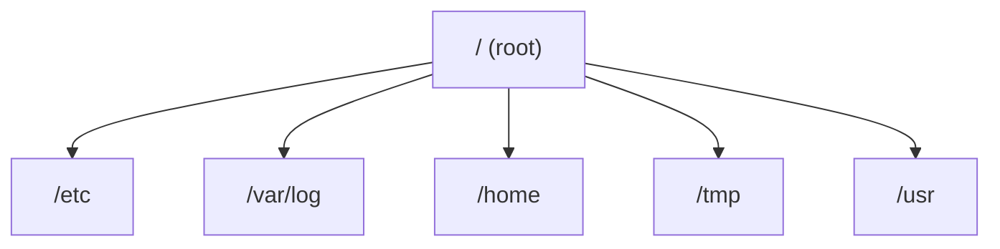

---

## 2. Permissions: chmod, chown

- **Owner, group, others** — read (r), write (w), execute (x).
- **chmod** — e.g. `chmod 755 file` (owner rwx, group/others rx).
- **chown** — change owner/group: `chown user:group file`.

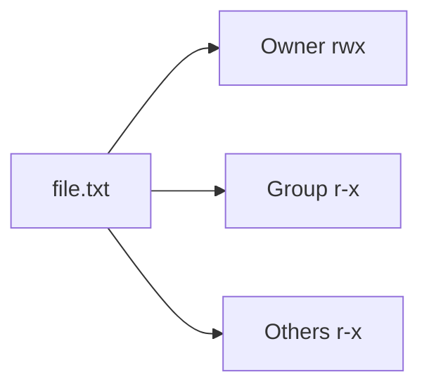

---

## 3. Users & Groups

- **Users** — who can log in and own files.
- **Groups** — share access. Use `id`, `groups`, `useradd`, `usermod`.

---

## 4. Logs

- **Where:** `/var/log/` — e.g. `syslog`, `auth.log`, app logs.
- **Commands:** `tail -f`, `less`, `grep` to read and follow logs.

---

## 5. Process Management

| Command | Use |
|---------|-----|
| `ps` | List processes |
| `top` | Live view, CPU/memory |
| `kill` / `kill -9` | Stop process (SIGTERM / SIGKILL) |
| `systemctl` | Start/stop/status services |

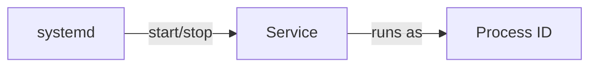

---

## 6. Ports & Networking Basics

- **netstat / ss** — see what’s listening: `ss -tlnp`.
- **curl** — hit HTTP endpoints: `curl http://localhost:80`.
- **Demo:** Run Nginx (or our frontend container), then `ss -tlnp` and `curl` to confirm port 80.

---

## 7. Networking: VPC, CIDR, Subnets, NAT

These concepts apply to AWS, GCP, Azure, and many on‑prem networks. Understanding them helps with Terraform, Kubernetes networking, and security.

### 7.1 VPC (Virtual Private Cloud)

- **VPC** = your own isolated network in the cloud. You choose an IP range (CIDR) and create subnets inside it.
- **Why:** Isolate workloads, control routing and firewalling, connect to on‑prem via VPN/Direct Connect.

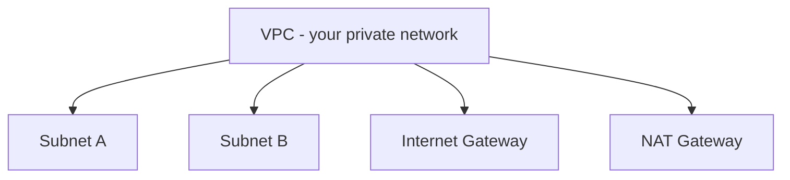

### 7.2 CIDR (Classless Inter-Domain Routing)

- **CIDR** = compact way to write an IP range and its size. Format: `base_ip/prefix_length`.
- **Prefix** = how many bits are fixed. Smaller number = bigger range.
  - `/16` → 65,536 IPs (e.g. `10.0.0.0/16` = 10.0.0.0 – 10.0.255.255)
  - `/24` → 256 IPs (e.g. `10.0.1.0/24` = 10.0.1.0 – 10.0.1.255)
  - `/32` → single IP
- **Example:** VPC `10.0.0.0/16`; subnets might be `10.0.1.0/24`, `10.0.2.0/24` in different AZs.

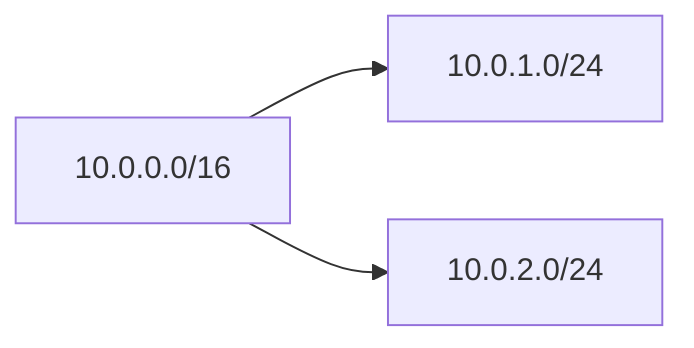

### 7.3 Subnets

- **Subnet** = segment of the VPC (a contiguous IP range). Usually one per AZ (Availability Zone).
- **Public subnet** — has a route to an **Internet Gateway (IGW)**; instances can get a public IP and be reached from the internet.
- **Private subnet** — no direct route to IGW; outbound traffic often goes through a **NAT Gateway** (or NAT instance) so instances can reach the internet but are not directly reachable from it.

| Type    | Route to internet        | Typical use                    |
|---------|--------------------------|--------------------------------|
| Public  | IGW (0.0.0.0/0 → igw-xxx)| Load balancers, bastions       |
| Private | NAT Gateway (0.0.0.0/0 → nat-xxx) | App servers, DBs, pods |

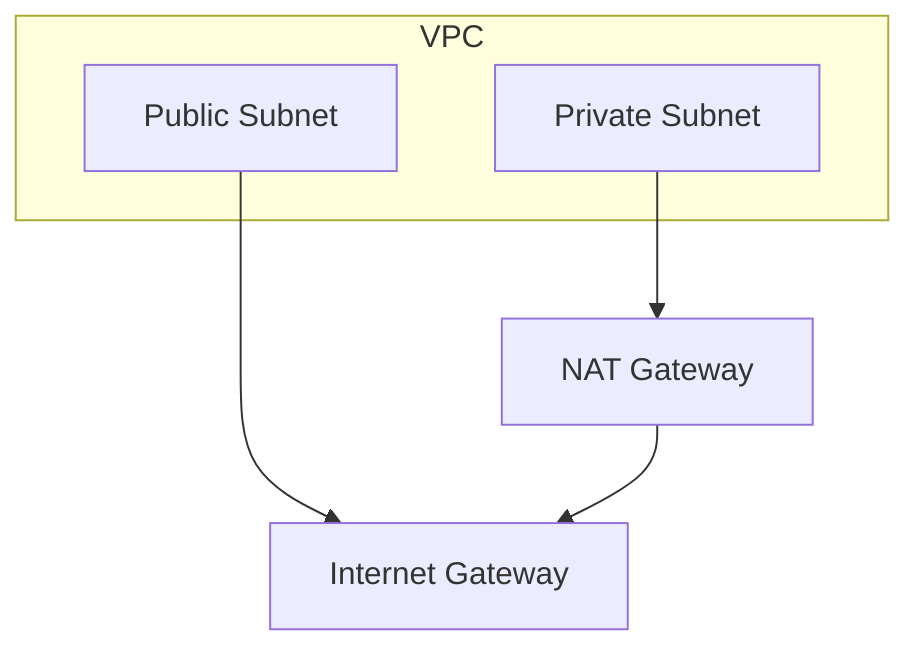

### 7.4 Internet Gateway (IGW)

- **IGW** = one per VPC; allows traffic between the VPC and the public internet.
- **Public subnets:** route `0.0.0.0/0` → IGW so instances can go out (and be reached if they have a public IP).
- **Private subnets:** do *not* route 0.0.0.0/0 to IGW (no direct internet).

### 7.5 NAT Gateway

- **NAT Gateway** = outbound-only gateway. Lives in a **public** subnet; has a public IP.
- **Private** subnets send outbound traffic to the NAT Gateway; NAT forwards to the internet. Return traffic comes back via NAT, so instances can download updates, call APIs, etc., without having a public IP.
- **Why:** Keep app/DB in private subnets (more secure) but still allow outbound internet (e.g. yum, Docker pull, external APIs).

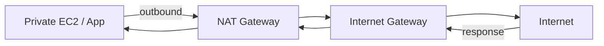

### 7.6 Route Tables

- Each subnet is associated with a **route table**. Routes say: “traffic to this destination → send to this target” (e.g. IGW, NAT Gateway, VPC peering).
- **Public subnet:** route table has `0.0.0.0/0 → igw-xxx`.
- **Private subnet:** route table has `0.0.0.0/0 → nat-xxx` (and no direct IGW route).

### 7.7 Availability Zones (AZs)

- **Availability Zone** = isolated data center within a region (e.g. `us-east-1a`, `us-east-1b`). AWS manages power and physical separation.
- **Best practice:** Put subnets in **different AZs** so one AZ failure doesn’t take down the whole app. E.g. public subnet in `us-east-1a` and `us-east-1b`; private subnets in both.
- **Subnet ↔ AZ:** Each subnet lives in exactly one AZ. You choose the AZ when creating the subnet.

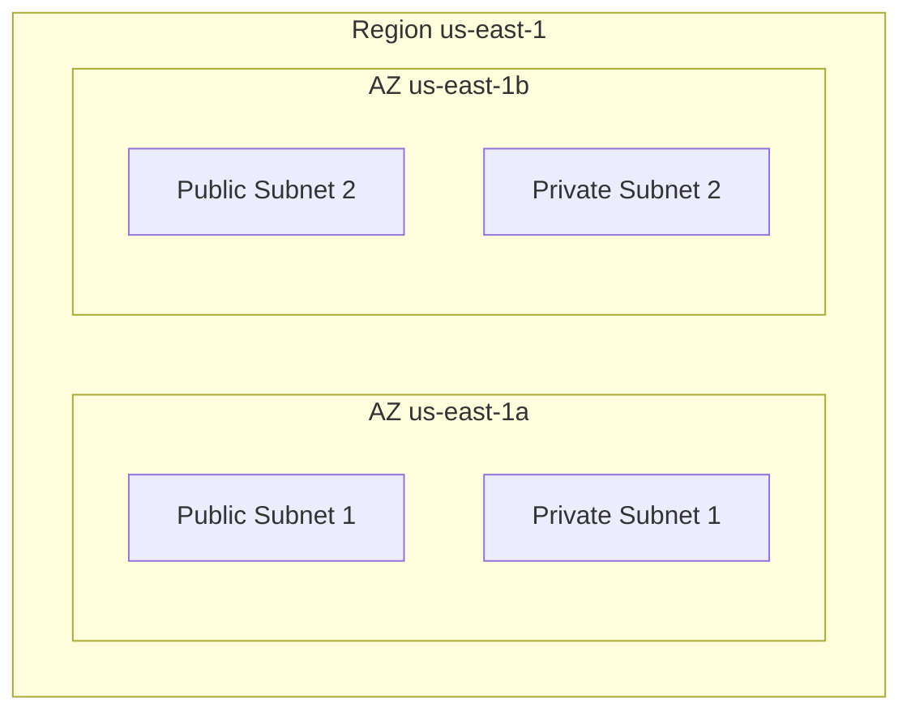

---

### 7.8 Security Groups (SG)

- **Security Group** = **stateful** firewall at the **instance (ENI)** level. You attach SGs to EC2, RDS, Lambda (VPC), etc.
- **Rules:** Inbound and outbound by port, protocol, and source/destination (CIDR or another SG). Allow only; no explicit “deny” (implicit deny for what’s not allowed).
- **Stateful:** If you allow inbound port 80, return traffic is automatically allowed. You don’t open outbound for the response.
- **Default:** New SG denies all inbound; allows all outbound. You add inbound rules (e.g. 22 from your IP, 80 from 0.0.0.0/0).

| Attribute | Security Group |
|-----------|----------------|
| Level | Instance (ENI) |
| State | Stateful |
| Rules | Allow only (by port, protocol, source/dest) |
| Scope | Can reference another SG (e.g. “allow from SG of ALB”) |

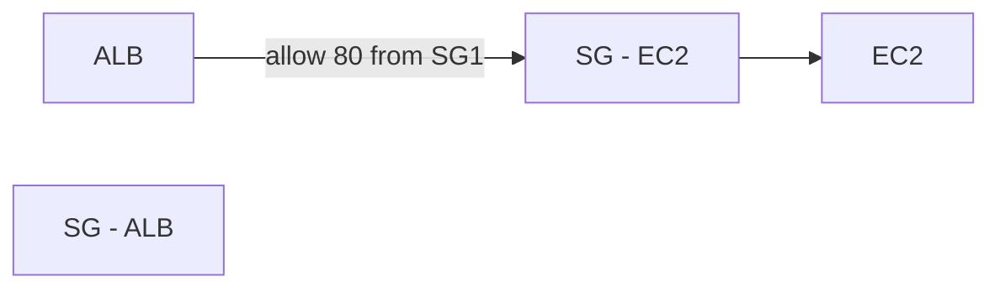

---

### 7.9 Network ACLs (NACL)

- **NACL** = **stateless** firewall at the **subnet** level. Each subnet has an NACL (default or custom).
- **Rules:** Numbered allow/deny rules; evaluated in order. You must explicitly allow return traffic (inbound and outbound).
- **Default NACL:** Allows all in/out; custom NACLs start by denying all, then you add allows.
- **Use case:** Subnet-level “backstop”; most day-to-day control is via Security Groups. NACLs for broad subnet-level blocks (e.g. deny a bad CIDR).

| Attribute | NACL |
|-----------|------|
| Level | Subnet |
| State | Stateless |
| Rules | Allow + Deny; numbered; order matters |
| Scope | CIDR only (no “other SG”) |

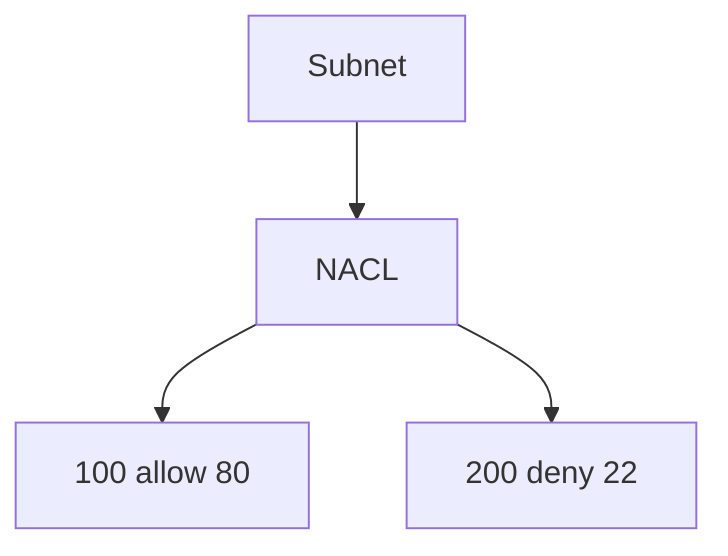

---

### 7.10 VPC Endpoints

- **VPC Endpoint** = private path from your VPC to an AWS service (or to another VPC) **without** sending traffic over the public internet.
- **Gateway endpoint** — for S3 and DynamoDB only. Free; you add a prefix list to a **route table** and traffic to S3/DynamoDB goes via the endpoint gateway. No NAT, no public IPs.
- **Interface endpoint (PrivateLink)** — ENI in your subnet; used for most other services (e.g. ECR, SQS, SNS, CloudWatch, KMS). You pay per hour and per GB; gives private DNS and private IP.

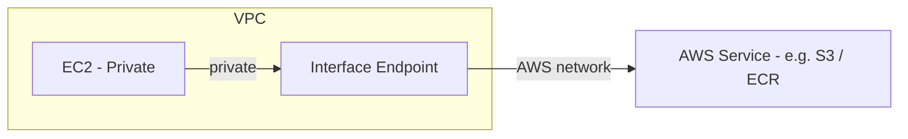

- **Why:** No internet egress for AWS API calls; lower latency; compliance (traffic stays on AWS backbone). Private subnets can pull images from ECR, write to S3, etc., without a NAT Gateway for that traffic.

---

### 7.11 Elastic IP (EIP)

- **Elastic IP** = static public IP you allocate and associate with an EC2 (or NAT Gateway). Survives stop/start; you can move it to another instance.
- **Use:** NAT Gateway gets an EIP; bastion or single public instance that needs a fixed IP. Avoid holding unused EIPs (small charge if not attached).

---

### 7.12 VPC Peering & Transit Gateway

- **VPC Peering** — connect two VPCs (same or different accounts/regions). Private IP routing between them; no transitive peering (A↔B and B↔C does not give A↔C).
- **Transit Gateway** — hub that many VPCs (and VPN/Direct Connect) attach to. Central routing; supports transitive connectivity and route tables per attachment.

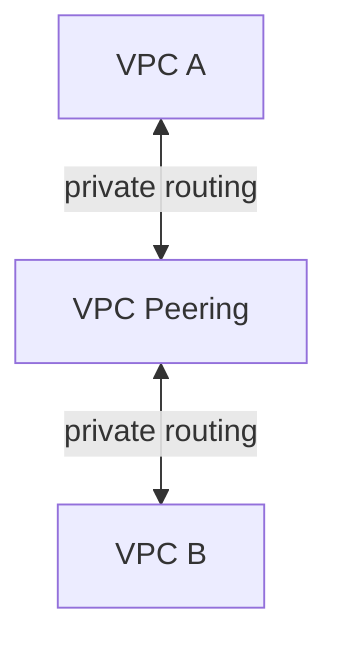

---

### 7.13 Full AWS VPC Architecture (One Picture)

Typical setup: one VPC, two AZs, public + private subnets per AZ, IGW and NAT Gateway, route tables, and Security Groups.

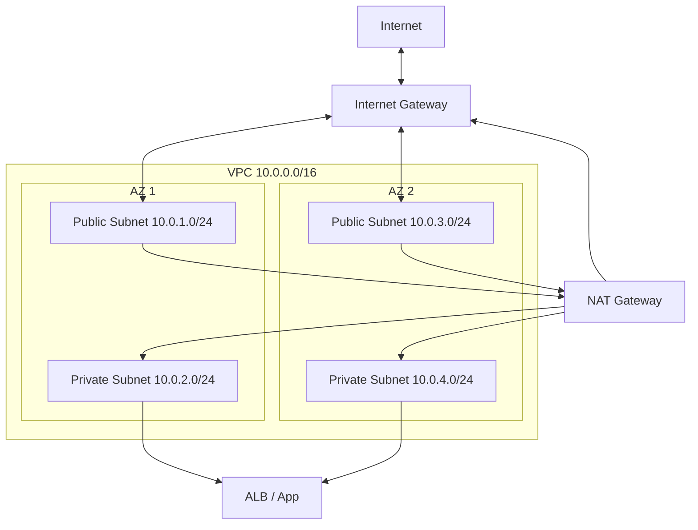

- **Public subnets:** Route `0.0.0.0/0` → IGW. ALB, NAT Gateway, bastions.
- **Private subnets:** Route `0.0.0.0/0` → NAT Gateway. App servers, DBs, pods; outbound via NAT, no direct internet to them.
- **Security Groups:** ALB SG allows 80/443 from internet; app SG allows 80/8080 from ALB SG only; RDS SG allows 5432 from app SG only.

---

### 7.14 Full Networking Reference

| Component | What it is | Where / scope |
|-----------|------------|----------------|
| **VPC** | Isolated network; you set CIDR | Region |
| **CIDR** | IP range + prefix (e.g. /16, /24) | VPC and subnets |
| **Subnet** | Segment of VPC; one AZ | One AZ per subnet |
| **AZ** | Availability Zone; isolated DC in a region | Region |
| **IGW** | VPC ↔ internet | One per VPC |
| **NAT Gateway** | Outbound-only internet; in public subnet | One per AZ for HA |
| **Route table** | Where subnet traffic goes (IGW, NAT, peering) | Subnet association |
| **Security Group** | Stateful firewall at ENI | Instance / resource |
| **NACL** | Stateless firewall at subnet | Subnet |
| **VPC Endpoint** | Private path to AWS service (or VPC) | Gateway or ENI in subnet |
| **Elastic IP** | Static public IP for EC2 or NAT | Account / region |
| **VPC Peering** | Private connectivity between two VPCs | Two VPCs |
| **Transit Gateway** | Hub for many VPCs and VPN | Region |

---

## 8. Quick Recap

- **Linux:** Files (`/etc`, `/var/log`), permissions (chmod/chown), logs, processes (ps, top, kill, systemctl), ports (ss, curl).
- **AWS VPC (full):** VPC + CIDR; subnets per AZ (public vs private); IGW and NAT Gateway; route tables; **Security Groups** (stateful, instance-level); **NACLs** (stateless, subnet-level); **VPC Endpoints** (private AWS API); Elastic IP; **VPC Peering** / Transit Gateway. Use the full-architecture diagram and reference table to tie it together.

---

**Day 3 | Sheet 3**
