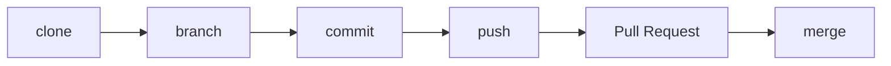
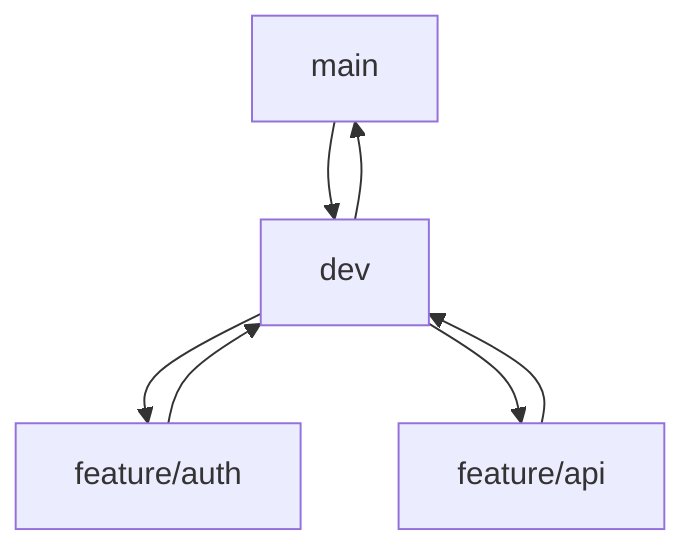

# Day 4 — Git (Condensed & Practical)

**Sheet 4**

Enough Git for DevOps: clone, branch, merge, pull request, and conflict resolution.

---

## 1. Why Version Control

- **History** — who changed what, when.
- **Collaboration** — branches, merge, code review.
- **Rollback** — revert bad changes. Essential for infra and app code.

---

## 2. Core Workflow

- **clone** — get repo: `git clone <url>`
- **branch** — work in isolation: `git checkout -b feature-x`
- **commit** — save changes: `git add . && git commit -m "msg"`
- **push** — send to remote: `git push origin feature-x`
- **Pull Request** — propose merge (GitHub/GitLab).
- **merge** — bring branch into main after review.

---

## 3. Branching Strategy

- **main** — production-ready.
- **dev** — integration branch.
- **feature/*** — one branch per feature; merge into dev, then dev into main.

---

## 4. Merge Conflicts

- When two branches change the same lines, Git asks you to resolve.
- **Steps:** open conflicted file, choose “ours”/“theirs” or edit manually, `git add`, `git commit`.

---

## 5. What We Skip (For This Course)

- Git internals (blobs, trees).
- Deep rebase and stash. Git is a tool; we focus on workflow, not theory.

---

## 6. Quick Recap

- clone → branch → commit → push → PR → merge.
- Strategy: main / dev / feature branches.
- Resolve conflicts by editing and re-committing.

---

**Day 4 | Sheet 4**
