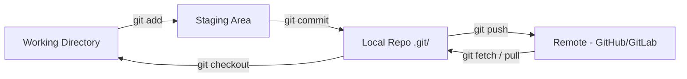
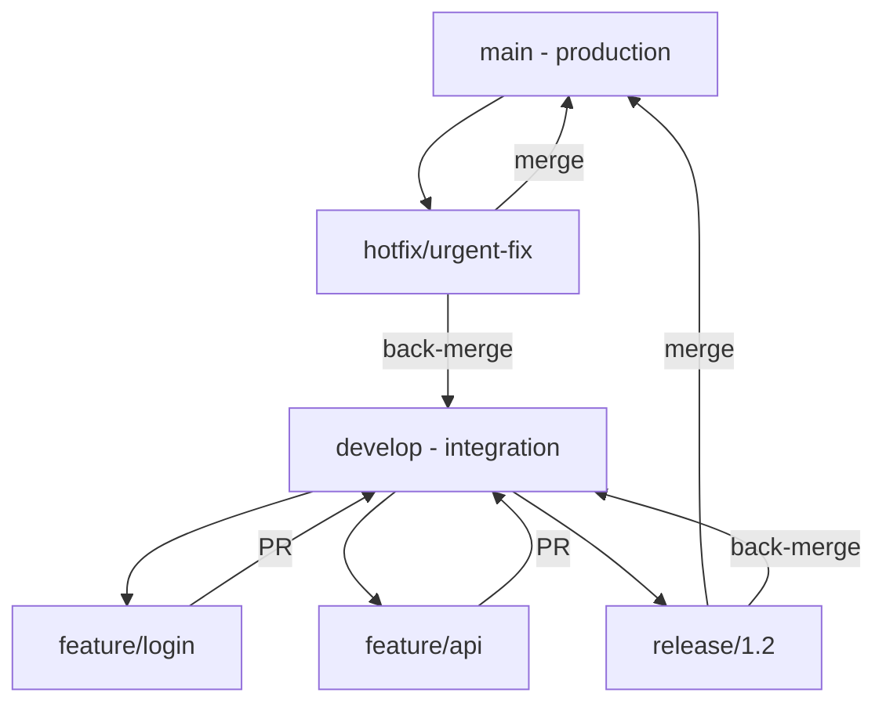
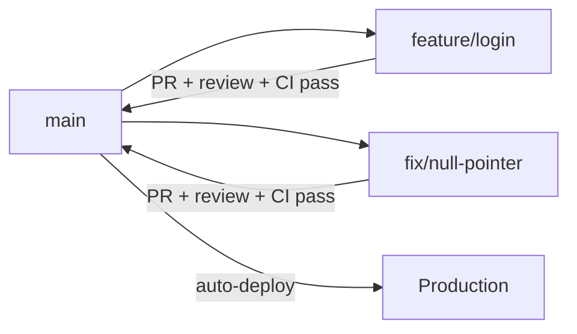
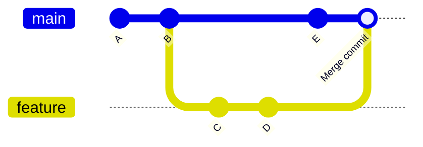
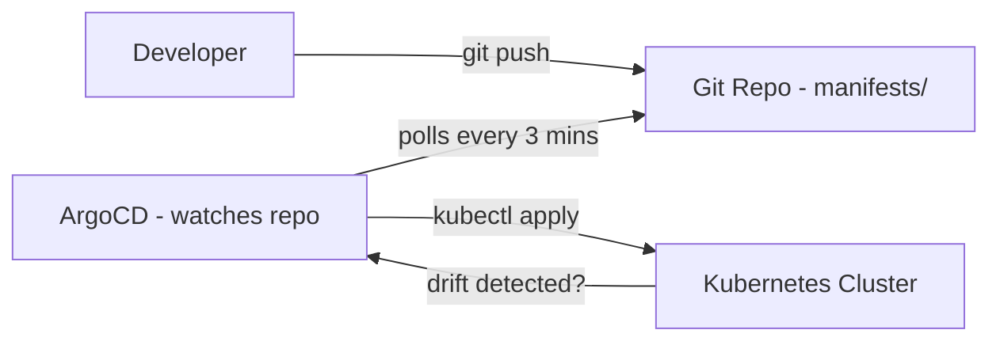

# Day 4 — Git: From Daily Use to Production-Grade Workflows

**Sheet 4**

> **Goal of this sheet:** Everything a DevOps engineer, SRE, or cloud engineer builds up over 4 years of using Git daily — compressed into one reference. From basic commits to conflict resolution, branching strategies, hooks, secrets recovery, and monorepo patterns.

---

## Why Git? The Honest Answer

Every change to every system you manage — application code, Terraform, Kubernetes manifests, Helm charts, CI/CD pipelines, Ansible playbooks — should go through Git. Not because someone mandated it. Because without it, you have no audit trail, no rollback, no code review, and no way to collaborate without overwriting each other's work.

In a DevOps workflow, Git is not just version control. It is the trigger for everything:

```
Push to Git → CI pipeline runs → Image built → Tests pass → Deploy to staging → Merge to main → Deploy to prod
```

GitOps takes this further — the cluster itself watches a Git repo and reconciles state from it. Git becomes the source of truth for what should be running.

| Role | Why Git Depth Matters |
|------|-----------------------|
| **DevOps Engineer** | Every pipeline, every manifest, every script lives in Git |
| **SRE** | Incident postmortems, runbook versions, infra changes — tracked in Git |
| **Cloud Engineer** | Terraform and Terragrunt are meaningless without Git history and branching |
| **Platform Engineer** | Helm chart versions, GitOps (ArgoCD/Flux) — Git is the control plane |

---

## 1. How Git Actually Works — The Mental Model

Most people use Git by muscle memory without knowing what's happening. Knowing the model makes you faster and less afraid of "I broke something."

**Three areas on your local machine:**

```
Working Directory  →  Staging Area (Index)  →  Local Repository  →  Remote (GitHub/GitLab)
   (your files)         (git add)               (git commit)          (git push)
```



**What `.git/` contains:**
- `objects/` — every file, every commit, ever (content-addressed by SHA)
- `refs/heads/` — your branches (just a file containing a commit SHA)
- `HEAD` — which branch you're on right now
- `config` — remote URLs, user settings
- `hooks/` — scripts that run on git events

**Key insight:** A branch is just a pointer to a commit. Creating a branch is instant and free. There is no "cost" to branching heavily.

---

## 2. Setup — First Things First

```bash
git config --global user.name "Your Name"
git config --global user.email "you@company.com"
git config --global core.editor "vim"              # or nano, code --wait
git config --global init.defaultBranch main
git config --global pull.rebase false              # merge on pull (safer default)
git config --global core.autocrlf input            # LF on macOS/Linux

git config --list                                  # verify all settings
cat ~/.gitconfig                                   # same, directly
```

**Per-repo override (useful for work vs personal repos):**
```bash
git config user.email "work@company.com"           # inside the repo, no --global
```

---

## 3. Core Commands — The Daily Workflow

**Starting:**
```bash
git init                                # initialize new repo
git clone <url>                         # clone existing
git clone <url> --depth 1               # shallow clone (just latest, no history — faster for CI)
git clone <url> -b develop              # clone specific branch
```

**Checking state:**
```bash
git status                              # what's changed, what's staged
git diff                                # unstaged changes (working dir vs staging)
git diff --staged                       # staged changes (staging vs last commit)
git diff main..feature/auth             # diff between two branches
git diff HEAD~3                         # diff against 3 commits ago
```

**Staging and committing:**
```bash
git add file.txt                        # stage one file
git add src/                            # stage a directory
git add -p                              # interactive — stage hunks, not whole files
git add .                               # stage everything (use carefully)

git commit -m "feat: add login endpoint"
git commit --amend -m "corrected msg"   # fix the last commit message (before push only)
git commit --amend --no-edit            # add more files to last commit (before push only)
```

**Pushing and pulling:**
```bash
git push origin feature/auth            # push branch
git push -u origin feature/auth         # push + set upstream (then just git push)
git push --force-with-lease             # safer force push (fails if remote has new commits)

git pull                                # fetch + merge
git fetch origin                        # download changes, don't merge
git fetch --prune                       # fetch + remove deleted remote branches locally
git merge origin/main                   # merge fetched main into current branch
```

---

## 4. Branching — Strategy That Scales

**Core commands:**
```bash
git branch                              # list local branches
git branch -a                           # list all including remote
git branch feature/login                # create branch (stays on current)
git checkout feature/login              # switch to branch
git checkout -b feature/login           # create and switch (most common)
git switch -c feature/login             # modern equivalent of checkout -b

git branch -d feature/login             # delete merged branch
git branch -D feature/login             # force delete (unmerged)
git push origin --delete feature/login  # delete remote branch
```

**The three main branching strategies:**

### Strategy 1 — Git Flow (stable, larger teams)



- `main` — only production-ready code. Tagged releases.
- `develop` — integration. Features merge here first.
- `feature/*` — one per feature, branch from develop.
- `release/*` — prep for a release (version bump, docs).
- `hotfix/*` — emergency fix branched from main.

**When to use:** Product teams with scheduled releases, QA cycles, multiple versions in production.

### Strategy 2 — GitHub Flow (simple, fast deployment)



- Only `main` and feature branches.
- Every merge to `main` deploys to production.
- Works with strong CI/CD and feature flags.

**When to use:** Startups, SaaS teams doing continuous delivery. Most DevOps teams use this.

### Strategy 3 — Trunk-Based Development (fastest, for senior teams)

- Everyone commits to `main` (trunk) directly or via very short-lived branches (< 1 day).
- Feature flags hide incomplete features.
- CI must be fast and reliable.
- Used by Google, Facebook, large-scale engineering orgs.

**Rule of thumb for this course:** Use GitHub Flow. Keep it simple.

---

## 5. Merging vs Rebasing — Know the Difference

**Merge** — creates a merge commit; preserves full history as-is.
```bash
git checkout main
git merge feature/login
# creates a merge commit on main
```

**Rebase** — replays your commits on top of the target branch; linear history.
```bash
git checkout feature/login
git rebase main
# your commits are replayed on top of current main
```



**When to use what:**
| | Merge | Rebase |
|--|-------|--------|
| Shared branches | Always | Never (rewrites history others depend on) |
| Feature branch cleanup | OK | Good (clean history before PR) |
| Pull from main into your branch | `git merge main` | `git rebase main` (preferred) |
| Golden rule | Safe always | Never rebase public/shared branches |

**Interactive rebase — cleaning up before a PR:**
```bash
git rebase -i HEAD~4       # interactively rebase last 4 commits
```
You'll see:
```
pick a1b2c3 WIP
pick d4e5f6 fix typo
pick g7h8i9 more fixes
pick j0k1l2 done

# Change to:
pick a1b2c3 WIP
squash d4e5f6 fix typo     # squash into previous
squash g7h8i9 more fixes   # squash into previous
reword j0k1l2 done         # keep but rename
```

This turns 4 messy commits into 1 clean commit before the PR. Keeps `main` history readable.

---

## 6. Merge Conflicts — How to Actually Resolve Them

Conflicts happen when two branches change the same lines. Git marks them:

```
<<<<<<< HEAD
  return render_template("home.html", user=current_user)
=======
  return render_template("home.html", user=session["user"])
>>>>>>> feature/session-auth
```

**Resolution process:**
```bash
git merge feature/session-auth    # triggers conflict

# Git marks conflicted files — check status
git status                        # shows "both modified: app.py"

# Open the file, resolve manually (pick one side or combine)
# Remove all <<<, ===, >>> markers

git add app.py                    # mark as resolved
git commit                        # completes the merge
```

**Using a merge tool:**
```bash
git mergetool                     # opens configured 3-way merge tool (vimdiff, VS Code, etc.)
git config --global merge.tool vscode
git config --global mergetool.vscode.cmd 'code --wait $MERGED'
```

**Aborting a merge:**
```bash
git merge --abort                 # back to pre-merge state (any time before commit)
git rebase --abort                # same for rebase
```

**Conflict prevention habits:**
- Pull from main into your branch frequently (`git rebase main` or `git merge main`)
- Keep feature branches short-lived (< 3 days ideally)
- Don't refactor + feature in the same branch

---

## 7. Undoing Things — The Most Important Section

```bash
# Undo last commit, keep changes staged
git reset --soft HEAD~1

# Undo last commit, keep changes in working dir (unstaged)
git reset HEAD~1

# Undo last commit, DISCARD changes (destructive)
git reset --hard HEAD~1

# Undo a specific commit by creating a new "undo" commit (safe for shared branches)
git revert a1b2c3

# Unstage a file (keep changes in working dir)
git restore --staged file.txt

# Discard changes in working dir (destructive)
git restore file.txt

# Go back to a previous commit temporarily (detached HEAD)
git checkout a1b2c3

# Create a branch from that point
git checkout -b recovery-branch a1b2c3
```

**The reflog — your safety net:**
```bash
git reflog                        # every HEAD position in the last 90 days
# Output:
# a1b2c3 HEAD@{0}: commit: add login
# d4e5f6 HEAD@{1}: reset: moving to HEAD~1
# g7h8i9 HEAD@{2}: commit: WIP

git checkout g7h8i9               # recover "deleted" commit
git checkout -b rescued g7h8i9   # create branch from it
```

`git reflog` is how you recover from `git reset --hard` and similar mistakes. It's almost always recoverable if you haven't done a garbage collect.

---

## 8. Stash — Save Work Without Committing

```bash
git stash                         # stash current changes
git stash push -m "WIP login"     # with a name
git stash list                    # see all stashes
git stash pop                     # apply latest stash and drop it
git stash apply stash@{2}         # apply specific stash (keep it in stash list)
git stash drop stash@{0}          # delete a stash
git stash clear                   # delete all stashes
git stash branch feature/recovery # create a branch from the stash
```

**When you use this:** You're midway through work and someone says "urgent fix on main" — stash, fix, come back.

---

## 9. Tags — Marking Releases

```bash
git tag                           # list tags
git tag v1.2.3                    # lightweight tag (just a pointer)
git tag -a v1.2.3 -m "Release 1.2.3"   # annotated tag (has metadata — use this)
git tag -a v1.2.3 a1b2c3          # tag a specific commit

git push origin v1.2.3            # push one tag
git push origin --tags            # push all tags

git checkout v1.2.3               # check out a tag (detached HEAD)
git tag -d v1.2.3                 # delete local tag
git push origin --delete v1.2.3  # delete remote tag
```

**In CI/CD:** Tags often trigger release pipelines. A push of `v*` pattern triggers the build-and-publish pipeline.

---

## 10. Git Log — Reading History Like a Pro

```bash
git log                                      # full log
git log --oneline                            # compact one-line per commit
git log --oneline --graph --all              # visual branch graph
git log --oneline -10                        # last 10 commits
git log --author="Surya"                     # by author
git log --since="2 weeks ago"               # by date
git log --grep="fix"                         # commits with "fix" in message
git log -S "function_name"                   # commits that added/removed this string (pickaxe)
git log -- path/to/file.py                   # commits touching a specific file

git show a1b2c3                              # show a specific commit
git show HEAD                                # show latest commit
git blame file.py                            # who wrote which line, which commit
git blame -L 10,20 file.py                  # blame just lines 10-20
```

**Finding when a bug was introduced — git bisect:**
```bash
git bisect start
git bisect bad                               # current commit is bad
git bisect good v1.1.0                       # this tag was good

# Git checks out a midpoint commit
# Test your app, then:
git bisect good                              # or git bisect bad

# Repeat until Git identifies the exact commit that introduced the bug
git bisect reset                             # go back to HEAD when done
```

This binary searches your commit history. Extremely powerful for "it was working 3 weeks ago" incidents.

---

## 11. Remote Management

```bash
git remote -v                                # list remotes
git remote add upstream <url>               # add another remote (common for forks)
git remote set-url origin <new-url>         # change remote URL
git remote remove upstream                  # remove a remote

# Syncing a fork with the original repo:
git fetch upstream
git checkout main
git merge upstream/main
git push origin main
```

**Working with multiple remotes (common in enterprise):**
```bash
git remote add github  git@github.com:company/repo.git
git remote add gitlab  git@gitlab.company.com:company/repo.git
git push github main
git push gitlab main
```

---

## 12. Git Hooks — Automation at the Commit Level

Hooks are scripts in `.git/hooks/` that run on Git events. They don't get pushed — each developer has their own.

**Common hooks:**

| Hook | When it runs | Use |
|------|-------------|-----|
| `pre-commit` | Before commit is created | Linting, formatting, secret scanning |
| `commit-msg` | After commit message written | Enforce conventional commits format |
| `pre-push` | Before push to remote | Run tests, check branch name |
| `post-merge` | After a merge | Reinstall dependencies if lockfile changed |

**Example: pre-commit hook that prevents committing secrets:**
```bash
#!/usr/bin/env bash
# .git/hooks/pre-commit

# Block any file with common secret patterns
if git diff --cached --name-only | xargs grep -l "aws_secret_access_key\|password\s*=\s*['\"]" 2>/dev/null; then
  echo "ERROR: Possible secret detected in staged files. Aborting commit."
  exit 1
fi
```

**Example: commit-msg hook enforcing Conventional Commits:**
```bash
#!/usr/bin/env bash
# .git/hooks/commit-msg
MSG=$(cat "$1")
if ! echo "$MSG" | grep -qE "^(feat|fix|docs|style|refactor|test|chore|ci|build|perf)(\(.+\))?: .+"; then
  echo "ERROR: Commit message must follow Conventional Commits format."
  echo "Example: feat(auth): add JWT login endpoint"
  exit 1
fi
```

**Make hooks shareable — use pre-commit framework:**
```bash
pip install pre-commit
# Create .pre-commit-config.yaml in repo root:
repos:
  - repo: https://github.com/pre-commit/pre-commit-hooks
    rev: v4.5.0
    hooks:
      - id: trailing-whitespace
      - id: end-of-file-fixer
      - id: detect-private-key
      - id: check-yaml
  - repo: https://github.com/gitleaks/gitleaks
    rev: v8.18.0
    hooks:
      - id: gitleaks

pre-commit install          # installs hooks into .git/hooks/
pre-commit run --all-files  # run manually
```

---

## 13. .gitignore — What Never Goes Into Git

```bash
# Create .gitignore in repo root
touch .gitignore
```

**Standard .gitignore for a DevOps repo:**
```
# Secrets and credentials — NEVER commit these
.env
.env.*
*.pem
*.key
*_rsa
*_dsa
credentials.json
terraform.tfvars        # if it contains real values

# Terraform
.terraform/
*.tfstate
*.tfstate.backup
.terraform.lock.hcl    # optional — some teams commit this

# Python
__pycache__/
*.pyc
.venv/
venv/
dist/
build/
*.egg-info/

# Node
node_modules/
.npm/

# OS files
.DS_Store
Thumbs.db

# IDE
.idea/
.vscode/
*.swp

# Build artifacts
*.jar
*.war
dist/
target/
```

**If you already committed a file by mistake:**
```bash
git rm --cached .env                    # stop tracking (keeps file locally)
git rm --cached -r .terraform/          # stop tracking directory
echo ".env" >> .gitignore
git commit -m "chore: stop tracking .env"
```

**If a secret was committed and pushed — treat it as compromised. Rotate the credential immediately. Then:**
```bash
# Remove from history (rewrites history — coordinate with team)
git filter-repo --path .env --invert-paths
# or
git filter-branch --force --index-filter 'git rm --cached --ignore-unmatch .env' --prune-empty --tag-name-filter cat -- --all
git push origin --force --all
```

Even after this, assume the secret was seen. Always rotate first, clean history second.

---

## 14. Commit Messages — The Conventional Commits Standard

Good commit messages are searchable, parseable by CI tools, and auto-generate changelogs.

**Format:**
```
<type>(<scope>): <short summary>

<optional body>

<optional footer>
```

**Types:**
| Type | Use |
|------|-----|
| `feat` | New feature |
| `fix` | Bug fix |
| `docs` | Documentation only |
| `style` | Formatting, no logic change |
| `refactor` | Code change, no feature or fix |
| `test` | Adding or fixing tests |
| `chore` | Build process, dependency updates |
| `ci` | CI/CD config changes |
| `perf` | Performance improvement |

**Examples:**
```
feat(auth): add JWT token refresh endpoint

fix(db): handle connection timeout on startup

ci(pipeline): add docker build cache step

chore(deps): bump flask from 2.3.0 to 3.0.0

feat(k8s)!: remove deprecated v1beta1 API  ← ! means breaking change
```

**Why this matters for DevOps:**
- `BREAKING CHANGE` in footer → auto-bump major version in semantic-release
- `fix:` → auto-bump patch version
- `feat:` → auto-bump minor version
- CI can filter "no code changes" commits and skip unnecessary builds

---

## 15. Git in CI/CD — How Pipelines Use Git

The CI system clones your repo on every pipeline run. Understand what it does:

```bash
# What Jenkins/GitHub Actions does on every run:
git clone --depth 1 <repo> .                # shallow clone — no history needed for build
git checkout <branch_or_sha>

# For PR/MR pipelines:
git fetch origin main
git merge --no-edit FETCH_HEAD              # merge main into PR branch to test integration
```

**Triggering pipelines with Git:**
```yaml
# GitHub Actions example trigger patterns
on:
  push:
    branches: [main, develop]
  pull_request:
    branches: [main]
  push:
    tags: ['v*.*.*']                        # release pipeline on version tags
```

**CI environment variables from Git:**
```bash
GIT_COMMIT=$(git rev-parse HEAD)           # full SHA — use as image tag
GIT_SHORT=$(git rev-parse --short HEAD)    # short SHA
GIT_BRANCH=$(git rev-parse --abbrev-ref HEAD)
GIT_TAG=$(git describe --tags --abbrev=0)  # nearest tag
```

**Tagging Docker images with Git SHA:**
```bash
docker build -t myapp:$(git rev-parse --short HEAD) .
docker push myapp:$(git rev-parse --short HEAD)
```

This makes every image traceable back to a commit. When something breaks in production, you know exactly what code is running.

---

## 16. GitOps — Git as the Control Plane

In GitOps (ArgoCD, Flux), you don't `kubectl apply` manually. You commit to Git, and the cluster reconciles to match.



**What this means for your Git discipline:**
- `manifests/` and `helm/` directories are the single source of truth
- No one runs `kubectl apply` manually in production
- All infra changes go through PR → review → merge → auto-deploy
- Rollback = `git revert` or point to previous image tag

---

## 17. Monorepo vs Polyrepo — Knowing the Trade-offs

| | Monorepo | Polyrepo |
|--|---------|---------|
| All services in one repo | Yes | No |
| Cross-service changes in one PR | Easy | Requires multiple PRs |
| CI runs on everything on every push | Yes (needs filtering) | Only affected services |
| Dependency management | Centralized | Independent per service |
| Examples | Google, Meta (internal), Nx, Turborepo | Most startups |
| DevOps consideration | Need path-based CI triggers | Simpler CI per repo |

**Path-based CI trigger (GitHub Actions monorepo pattern):**
```yaml
on:
  push:
    paths:
      - 'app/backend/**'
      - 'manifests/backend-*'
```

Only runs when backend files change. Otherwise the pipeline is skipped.

---

## 18. Useful Aliases — Speed Up Daily Work

Add to `~/.gitconfig`:
```ini
[alias]
  st = status
  co = checkout
  br = branch
  ci = commit
  lg = log --oneline --graph --all --decorate
  unstage = restore --staged
  last = log -1 HEAD --stat
  undo = reset --soft HEAD~1
  pushf = push --force-with-lease
  cleanup = "!git branch --merged main | grep -v 'main\\|\\*' | xargs -n 1 git branch -d"
```

```bash
git lg                   # visual branch graph
git undo                 # undo last commit, keep changes
git cleanup              # delete all local branches already merged to main
git pushf                # safe force push
```

---

## 19. Production Incident — Git Commands You'll Actually Use

```bash
# What changed in the last deploy?
git log v1.2.2..v1.2.3 --oneline

# What files changed between two releases?
git diff v1.2.2..v1.2.3 --name-only

# Who last touched this line?
git blame -L 45,50 app/backend/api.py

# When was this function introduced or last changed?
git log -S "def process_payment" --oneline

# Roll back to last known good tag
git checkout v1.2.2
git checkout -b hotfix/rollback-to-1.2.2
git push origin hotfix/rollback-to-1.2.2

# What does this commit actually contain?
git show a1b2c3 --stat
git show a1b2c3 -- app/backend/api.py

# Find the commit that introduced a bug
git bisect start
git bisect bad HEAD
git bisect good v1.1.0
```

---

## 20. Quick Reference Card

| Category | Commands |
|----------|---------|
| **Init / Clone** | `git init`, `git clone`, `git clone --depth 1` |
| **Daily** | `git status`, `git diff`, `git add -p`, `git commit -m`, `git push` |
| **Branches** | `git checkout -b`, `git switch -c`, `git branch -d`, `git merge`, `git rebase` |
| **Undo** | `git reset --soft`, `git revert`, `git restore`, `git stash` |
| **History** | `git log --oneline --graph`, `git blame`, `git bisect`, `git reflog` |
| **Tags** | `git tag -a v1.0.0`, `git push --tags` |
| **Remote** | `git remote -v`, `git fetch --prune`, `git push --force-with-lease` |
| **Cleanup** | `git branch --merged`, `git gc`, `git remote prune origin` |

---

## Summary — What a 4-Year DevOps Engineer Knows Cold

1. The three-area model (working dir → staging → repo → remote) — never confused about state
2. Git Flow vs GitHub Flow — picks the right strategy for the team
3. Rebase for clean history, merge for shared branches — never rewrites public history
4. `git reflog` + `git bisect` — recovers from mistakes, finds regressions
5. Hooks and pre-commit — prevents secrets and bad commits from ever leaving the machine
6. Conventional Commits + tagging — enables automated changelogs and semantic versioning
7. Git in CI/CD — images tagged with SHA, shallow clones, path-based triggers
8. GitOps mindset — Git is the control plane, not just code storage

---

**Day 4 | Sheet 4**
