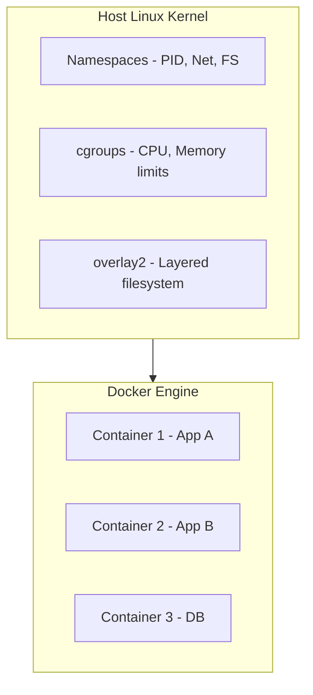
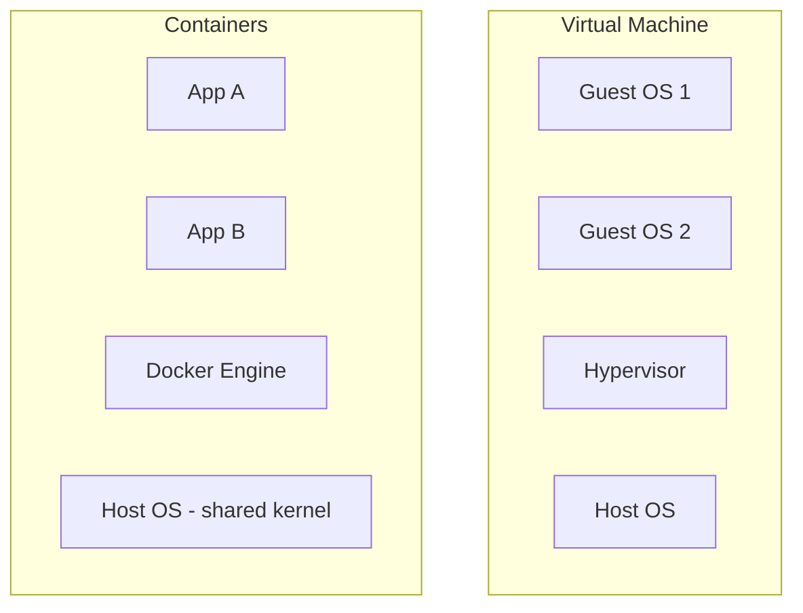
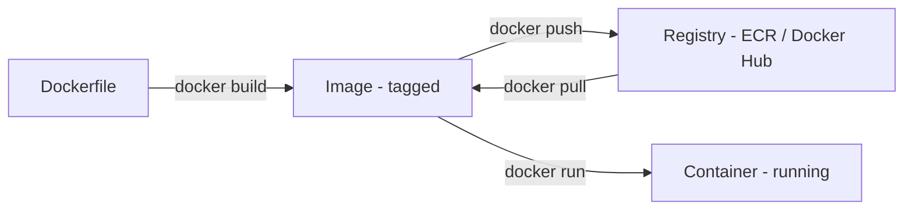
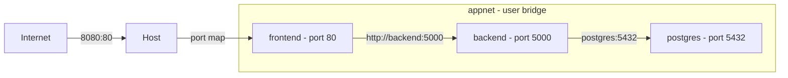
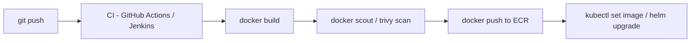

# Day 5 — Docker: From Containers to Production-Grade Patterns

**Sheet 5**

> **Goal of this sheet:** Everything a DevOps engineer, SRE, or cloud engineer builds up over 4 years of working with Docker — compressed into one reference. From what a container actually is, through writing production Dockerfiles, multi-stage builds, networking, volumes, Docker Compose, security, debugging, and how Docker connects to CI/CD and Kubernetes.

---

## Why Docker? The Honest Answer

Before containers, deploying an application meant:
- Installing the right Python/Node/Java version on every server
- Managing conflicting dependencies between apps on the same machine
- "It works on my machine" being a real and frequent problem
- VM per app = gigabytes of OS overhead, slow startup, expensive

Docker solved this by packaging the app and its entire runtime into one artifact — the image. You build it once, run it anywhere. Same image in dev, CI, staging, and production.

**What Docker actually gives you:**

| Problem Before | Docker Solution |
|---------------|----------------|
| "Works on my machine" | Same image runs everywhere |
| Dependency conflicts | Each container has its own isolated dependencies |
| Slow VM startup (minutes) | Container starts in seconds |
| "Which version of Python is installed?" | Pinned in the Dockerfile, always reproducible |
| Deploying = SSH + script + pray | `docker run` or `helm upgrade` |
| Rollback = SSH + manual steps | `docker run` previous image tag |

| Role | Why Docker Depth Matters |
|------|--------------------------|
| **DevOps Engineer** | Build pipelines produce Docker images; deployments run them |
| **SRE** | Debugging containers in production, reading logs, resource limits |
| **Cloud Engineer** | ECS, EKS, Cloud Run — all run Docker images |
| **Platform Engineer** | Base image standardization, registry management, security scanning |

---

## 1. What Docker Actually Is — The Linux Under the Hood

Docker is not magic. It is a user-friendly CLI wrapping Linux kernel features. This matters because:
- Containers share the host kernel — they are not VMs
- A Linux container cannot run natively on Windows without a Linux VM layer
- Container isolation is only as strong as its configuration

**Linux features Docker uses:**

| Linux Feature | What Docker Uses It For |
|--------------|------------------------|
| **Namespaces** | Isolate PID, network, filesystem, users per container |
| **cgroups** | Limit CPU, memory, I/O per container |
| **Union filesystem (overlay2)** | Layer images on top of each other efficiently |
| **seccomp profiles** | Block dangerous syscalls from containers |
| **Linux capabilities** | Drop root privileges while keeping specific abilities |



**Container vs VM:**



| | VM | Container |
|--|----|----|
| Startup | Minutes | Seconds |
| Size | GBs | MBs |
| Isolation | Full OS boundary | Kernel namespace boundary |
| Overhead | High | Low |
| Use case | Full OS isolation, different kernels | App packaging and deployment |

---

## 2. Core Concepts — Image, Container, Registry

**Image** — read-only, layered template. Built from a Dockerfile. Tagged and pushed to a registry.

**Container** — a running (or stopped) instance of an image. Writable layer on top of the image layers. Ephemeral by default — data written inside is lost when the container is removed.

**Registry** — storage for images. Docker Hub (public), ECR (AWS), GCR (Google), GHCR (GitHub), Harbor (self-hosted).



**Layers — why images are efficient:**

Every instruction in a Dockerfile creates a layer. Layers are cached and shared between images.

```
FROM python:3.11-slim         ← layer 1 (base, ~150MB, shared across all python images)
RUN pip install flask         ← layer 2 (cached unless requirements change)
COPY . /app                   ← layer 3 (changes often — put late in Dockerfile)
CMD ["python", "app.py"]      ← layer 4 (metadata, no new data)
```

If only layer 3 changes on rebuild, layers 1 and 2 come from cache. Build is fast.

---

## 3. Docker CLI — Commands You Use Every Day

**Images:**
```bash
docker images                             # list local images
docker pull nginx:alpine                  # pull from registry
docker build -t myapp:1.0 .              # build from Dockerfile in current dir
docker build -t myapp:1.0 -f Dockerfile.prod .  # specify Dockerfile
docker rmi myapp:1.0                     # remove image
docker image prune                        # remove dangling images
docker image prune -a                     # remove all unused images
docker inspect myapp:1.0                 # full metadata as JSON
docker history myapp:1.0                 # show layers and sizes
```

**Containers:**
```bash
docker run nginx                                         # run (foreground)
docker run -d nginx                                      # detached (background)
docker run -d -p 8080:80 nginx                          # map host:container port
docker run -d --name web nginx                           # named container
docker run -d -e DB_HOST=postgres -e DB_PORT=5432 myapp # env vars
docker run -d -v /data:/var/lib/postgresql/data postgres # bind mount
docker run -d --network mynet myapp                      # connect to network
docker run --rm myapp python test.py                     # remove on exit

docker ps                          # running containers
docker ps -a                       # all containers including stopped
docker stop web                    # SIGTERM (graceful)
docker kill web                    # SIGKILL (immediate)
docker rm web                      # remove stopped container
docker rm -f web                   # force remove running container
docker restart web                 # stop + start

docker logs web                    # stdout/stderr
docker logs web -f                 # follow
docker logs web --tail 100         # last 100 lines
docker logs web --since 10m        # last 10 minutes

docker exec -it web bash           # interactive shell inside container
docker exec web cat /etc/nginx/nginx.conf  # run one command
docker exec -it web sh             # if bash not available (alpine images)

docker stats                       # live CPU/memory per container
docker stats --no-stream           # one snapshot
docker top web                     # processes inside the container
```

**Copying files:**
```bash
docker cp web:/etc/nginx/nginx.conf ./nginx.conf   # container → host
docker cp ./nginx.conf web:/etc/nginx/nginx.conf   # host → container
```

---

## 4. Writing Dockerfiles — From Basic to Production

### Basic Dockerfile

```dockerfile
FROM python:3.11-slim

WORKDIR /app

COPY requirements.txt .
RUN pip install --no-cache-dir -r requirements.txt

COPY . .

EXPOSE 5000

CMD ["python", "app.py"]
```

### Every Dockerfile Instruction Explained

| Instruction | What it does |
|-------------|-------------|
| `FROM` | Base image. Start here. |
| `WORKDIR` | Set working directory. Creates if missing. |
| `COPY` | Copy files from build context into image. |
| `ADD` | Like COPY but also handles URLs and tar extraction. Prefer COPY unless you need this. |
| `RUN` | Execute command during build. Creates a new layer. |
| `ENV` | Set environment variable (persists into container). |
| `ARG` | Build-time variable only. Not available at runtime. |
| `EXPOSE` | Document the port. Does NOT actually publish it (`-p` does that). |
| `CMD` | Default command when container starts. Overridable by `docker run <image> <cmd>`. |
| `ENTRYPOINT` | Fixed command. `CMD` becomes arguments to it. |
| `VOLUME` | Declare a mount point (creates anonymous volume if not mounted). |
| `USER` | Switch to this user for subsequent instructions and container runtime. |
| `HEALTHCHECK` | Command Docker runs to determine container health. |
| `ONBUILD` | Instruction that fires when this image is used as a base. |

### Layer Caching — Order Matters

**Bad (breaks cache often):**
```dockerfile
FROM python:3.11-slim
COPY . /app              # copies everything — any file change invalidates cache
RUN pip install -r /app/requirements.txt  # re-runs every time
```

**Good (cache-friendly):**
```dockerfile
FROM python:3.11-slim
WORKDIR /app
COPY requirements.txt .          # copy only this first
RUN pip install --no-cache-dir -r requirements.txt  # cached unless requirements.txt changes
COPY . .                         # copy rest of app (changes frequently, but pip is cached)
```

Rule: **put things that change less frequently higher in the Dockerfile.**

### Multi-Stage Build — Small, Secure Production Images

The build environment (compilers, build tools) has no place in the production image.

**Example — Go application:**
```dockerfile
# Stage 1: Build
FROM golang:1.21 AS builder
WORKDIR /app
COPY go.mod go.sum ./
RUN go mod download
COPY . .
RUN CGO_ENABLED=0 GOOS=linux go build -o server .

# Stage 2: Runtime
FROM scratch                    # or alpine — zero OS overhead
COPY --from=builder /app/server /server
EXPOSE 8080
ENTRYPOINT ["/server"]
```

Final image is just the binary — no Go toolchain, no source code, potentially under 10MB.

**Example — Python application (dev dependencies excluded):**
```dockerfile
# Stage 1: Build/install
FROM python:3.11-slim AS builder
WORKDIR /app
COPY requirements.txt .
RUN pip install --no-cache-dir --prefix=/install -r requirements.txt

# Stage 2: Runtime
FROM python:3.11-slim
WORKDIR /app
COPY --from=builder /install /usr/local
COPY . .
USER nobody
CMD ["python", "app.py"]
```

**Example — React/Node frontend:**
```dockerfile
# Stage 1: Build
FROM node:20-alpine AS builder
WORKDIR /app
COPY package*.json ./
RUN npm ci --only=production
COPY . .
RUN npm run build

# Stage 2: Serve
FROM nginx:alpine
COPY --from=builder /app/dist /usr/share/nginx/html
COPY nginx.conf /etc/nginx/conf.d/default.conf
EXPOSE 80
```

### Production Dockerfile Best Practices

```dockerfile
FROM python:3.11-slim

# 1. Never run as root
RUN groupadd -r appgroup && useradd -r -g appgroup appuser

WORKDIR /app

# 2. Cache-friendly layer ordering
COPY requirements.txt .
RUN pip install --no-cache-dir -r requirements.txt

COPY . .

# 3. Don't run as root
USER appuser

# 4. Declare what port this listens on (documentation)
EXPOSE 5000

# 5. Use exec form (not shell form) — proper signal handling
CMD ["python", "-m", "gunicorn", "--bind", "0:5000", "app:app"]

# 6. Healthcheck — Docker and orchestrators use this
HEALTHCHECK --interval=30s --timeout=5s --start-period=10s --retries=3 \
  CMD curl -f http://localhost:5000/health || exit 1
```

**Shell form vs exec form:**
```dockerfile
CMD python app.py              # shell form — runs via /bin/sh -c, PID 1 is shell, not your app
CMD ["python", "app.py"]       # exec form — your app is PID 1, receives signals directly
```

Always use exec form. Shell form means `docker stop` sends SIGTERM to the shell, not your app — your app gets SIGKILLed after the timeout.

---

## 5. Docker Networking — How Containers Talk

**Network types:**

| Driver | Use |
|--------|-----|
| `bridge` | Default. Containers on same bridge can communicate. NAT to host. |
| `host` | Container shares host network — no isolation. Max performance, no port mapping needed. |
| `none` | No networking at all. |
| `overlay` | Multi-host networking (Docker Swarm, rarely used now vs K8s). |
| `macvlan` | Container gets its own MAC/IP on the physical network. |

**Commands:**
```bash
docker network ls                          # list networks
docker network create mynet               # create bridge network
docker network create --driver bridge \
  --subnet 172.20.0.0/16 mynet            # with custom CIDR
docker network inspect mynet              # detail: containers, config
docker network connect mynet web          # add running container to network
docker network disconnect mynet web       # remove
docker network rm mynet                   # delete
docker network prune                      # delete unused
```

**Container DNS — how containers find each other:**

On a user-defined bridge network, Docker provides built-in DNS. Containers can reach each other by name.

```bash
docker network create appnet
docker run -d --name postgres --network appnet postgres:15
docker run -d --name backend --network appnet -e DB_HOST=postgres mybackend

# Inside backend container:
# ping postgres → resolves to postgres container's IP
# psql -h postgres -U user db → works
```

On the default bridge network, this DNS does NOT work. Always create a user-defined network.



**Exposing ports:**
```bash
docker run -p 8080:80 nginx             # host 8080 → container 80
docker run -p 127.0.0.1:8080:80 nginx  # only localhost (don't expose to public interface)
docker run -P nginx                     # publish all EXPOSED ports to random host ports
docker port web                         # show port mappings for container
```

---

## 6. Docker Volumes — Persisting Data

Containers are ephemeral. Data written to the container layer is lost on `docker rm`. Volumes solve this.

**Three types:**

| Type | Syntax | Use |
|------|--------|-----|
| Named volume | `-v pgdata:/var/lib/postgresql/data` | Databases, persistent app data |
| Bind mount | `-v /host/path:/container/path` | Dev: live code reload, configs |
| tmpfs mount | `--tmpfs /tmp` | In-memory temporary data, secrets |

```bash
# Named volumes
docker volume create pgdata
docker volume ls
docker volume inspect pgdata
docker volume rm pgdata
docker volume prune

# Run with named volume
docker run -d \
  -v pgdata:/var/lib/postgresql/data \
  -e POSTGRES_PASSWORD=secret \
  postgres:15

# Bind mount (development)
docker run -d \
  -v $(pwd)/app:/app \
  -p 5000:5000 \
  myapp

# The bind mount means code changes on host appear instantly in container
# Works great with Flask debug mode or nodemon
```

**Volume in Dockerfile:**
```dockerfile
VOLUME /var/lib/postgresql/data   # declares mount point; creates anonymous volume if not mounted
```

Avoid using `VOLUME` in Dockerfiles unless you need to guarantee a volume is always created. Prefer explicit `-v` at runtime.

---

## 7. Docker Compose — Multi-Container Local Development

For running multiple containers together (dev/test), Docker Compose is the standard.

**Basic compose file for our three-tier app:**

```yaml
# docker-compose.yml
version: "3.9"

services:
  postgres:
    image: postgres:15-alpine
    environment:
      POSTGRES_DB: appdb
      POSTGRES_USER: appuser
      POSTGRES_PASSWORD: ${DB_PASSWORD}    # from .env file
    volumes:
      - pgdata:/var/lib/postgresql/data
      - ./app/database/init.sql:/docker-entrypoint-initdb.d/init.sql
    healthcheck:
      test: ["CMD-SHELL", "pg_isready -U appuser -d appdb"]
      interval: 10s
      timeout: 5s
      retries: 5
    networks:
      - appnet

  backend:
    build:
      context: ./app/backend
      dockerfile: Dockerfile
    environment:
      DB_HOST: postgres
      DB_PORT: 5432
      DB_NAME: appdb
      DB_USER: appuser
      DB_PASSWORD: ${DB_PASSWORD}
      FLASK_ENV: development
    ports:
      - "5000:5000"
    volumes:
      - ./app/backend:/app     # live code reload in dev
    depends_on:
      postgres:
        condition: service_healthy    # waits for postgres healthcheck to pass
    networks:
      - appnet
    restart: unless-stopped

  frontend:
    build:
      context: ./app/frontend
      dockerfile: Dockerfile
    ports:
      - "8080:80"
    depends_on:
      - backend
    networks:
      - appnet
    restart: unless-stopped

volumes:
  pgdata:

networks:
  appnet:
    driver: bridge
```

**Compose commands:**
```bash
docker compose up                    # start all services (foreground)
docker compose up -d                 # detached
docker compose up --build            # rebuild images before starting
docker compose up backend            # start only one service
docker compose down                  # stop and remove containers
docker compose down -v               # also remove volumes (WARNING: deletes data)
docker compose ps                    # status of services
docker compose logs                  # all logs
docker compose logs -f backend       # follow backend logs
docker compose exec backend bash     # shell into running service
docker compose run backend pytest    # run one-off command in service container
docker compose restart backend       # restart one service
docker compose build                 # build all images
docker compose pull                  # pull base images
docker compose config                # validate and show merged config
```

**Multiple compose files — dev vs prod:**
```bash
# docker-compose.yml — base config
# docker-compose.override.yml — auto-applied in dev (bind mounts, debug mode)
# docker-compose.prod.yml — prod overrides

docker compose -f docker-compose.yml -f docker-compose.prod.yml up -d
```

**.env file for compose:**
```bash
# .env (never commit this)
DB_PASSWORD=supersecret
FLASK_SECRET_KEY=changeme
```

Compose auto-loads `.env` from the same directory. Reference values with `${VAR_NAME}`.

---

## 8. Image Tagging and Registry — The Production Pattern

**Tagging strategy:**
```bash
docker build -t myapp:latest .                        # avoid latest in prod — not traceable
docker build -t myapp:1.2.3 .                         # semantic version
docker build -t myapp:$(git rev-parse --short HEAD) . # git SHA — always traceable
docker build -t myapp:main-abc1234 .                  # branch + SHA
```

**Pushing to a registry:**
```bash
# Docker Hub
docker login
docker tag myapp:1.2.3 username/myapp:1.2.3
docker push username/myapp:1.2.3

# AWS ECR
aws ecr get-login-password --region us-east-1 | \
  docker login --username AWS --password-stdin 123456789.dkr.ecr.us-east-1.amazonaws.com

docker tag myapp:1.2.3 123456789.dkr.ecr.us-east-1.amazonaws.com/myapp:1.2.3
docker push 123456789.dkr.ecr.us-east-1.amazonaws.com/myapp:1.2.3

# GitHub Container Registry
echo $GHCR_TOKEN | docker login ghcr.io -u username --password-stdin
docker tag myapp:1.2.3 ghcr.io/orgname/myapp:1.2.3
docker push ghcr.io/orgname/myapp:1.2.3
```

**Pulling a specific image:**
```bash
docker pull myapp:1.2.3                   # by version
docker pull myapp@sha256:abc123...        # by digest (most reliable, immutable)
```

In production pipelines, always pin by digest or exact version tag, never `latest`.

---

## 9. Docker in CI/CD — The Build Pipeline Pattern

A typical CI pipeline using Docker:



**GitHub Actions — build, scan, push:**
```yaml
jobs:
  build:
    runs-on: ubuntu-latest
    steps:
      - uses: actions/checkout@v4

      - name: Set up Docker Buildx
        uses: docker/setup-buildx-action@v3

      - name: Login to ECR
        uses: aws-actions/amazon-ecr-login@v2

      - name: Build and push
        uses: docker/build-push-action@v5
        with:
          context: ./app/backend
          push: true
          tags: |
            ${{ env.ECR_REPO }}:${{ github.sha }}
            ${{ env.ECR_REPO }}:latest
          cache-from: type=gha        # GitHub Actions cache
          cache-to: type=gha,mode=max

      - name: Scan image
        uses: aquasecurity/trivy-action@master
        with:
          image-ref: ${{ env.ECR_REPO }}:${{ github.sha }}
          severity: CRITICAL,HIGH
          exit-code: 1               # fail pipeline if critical CVEs found
```

**Build cache strategies:**
```bash
# BuildKit inline cache (simple)
docker buildx build \
  --cache-from type=registry,ref=myapp:cache \
  --cache-to type=registry,ref=myapp:cache,mode=max \
  -t myapp:1.2.3 .

# GitHub Actions cache (fastest in GHA)
--cache-from type=gha
--cache-to type=gha,mode=max
```

---

## 10. Docker Security — What a Senior Engineer Knows

### Never Run as Root

```dockerfile
# Bad
FROM python:3.11-slim
CMD ["python", "app.py"]   # runs as root inside container

# Good
FROM python:3.11-slim
RUN useradd -r -u 1001 -g root appuser
USER 1001
CMD ["python", "app.py"]
```

### Don't Put Secrets in the Image

```dockerfile
# BAD — secret baked into image layer, visible in docker history
ENV DB_PASSWORD=supersecret

# GOOD — pass at runtime
docker run -e DB_PASSWORD=$DB_PASSWORD myapp

# BEST in production — use secret manager
# AWS Secrets Manager, HashiCorp Vault, Kubernetes Secrets (with external-secrets-operator)
```

**Docker BuildKit secrets (build-time secrets that don't persist in layers):**
```dockerfile
RUN --mount=type=secret,id=npmrc,target=/root/.npmrc \
    npm install
```
```bash
docker build --secret id=npmrc,src=$HOME/.npmrc .
```

### Read-Only Filesystem

```bash
docker run --read-only \
  --tmpfs /tmp \
  --tmpfs /var/run \
  myapp
```

Prevents an attacker who gets code execution from writing persistence mechanisms.

### Drop Capabilities

```bash
docker run --cap-drop ALL --cap-add NET_BIND_SERVICE myapp
```

By default, containers have more Linux capabilities than they need. Drop all and add back only what's required.

### Limit Resources

```bash
docker run \
  --memory 512m \
  --memory-swap 512m \        # swap = memory means no swap
  --cpus 1.5 \                # max 1.5 CPUs
  --pids-limit 100 \          # prevent fork bombs
  myapp
```

Without limits, one runaway container can starve others on the host.

### Image Scanning

```bash
# Trivy (open source, excellent)
trivy image myapp:1.2.3

# Docker Scout
docker scout cves myapp:1.2.3

# Grype
grype myapp:1.2.3
```

Integrate scanning into CI. Block deployments if critical CVEs are found.

### Use Minimal Base Images

| Base | Size | Use When |
|------|------|----------|
| `scratch` | 0MB | Go/Rust static binaries only |
| `alpine` | ~5MB | Small, but musl libc (check compatibility) |
| `distroless` | ~20MB | Google's minimal — no shell, very secure |
| `debian-slim` | ~75MB | Most compatible, production safe |
| `ubuntu` | ~80MB | Full OS, avoid in prod |
| `python:3.11` | ~900MB | Never use in production — use slim variant |
| `python:3.11-slim` | ~150MB | Good production choice for Python |
| `python:3.11-alpine` | ~50MB | Smallest, but pip may fail for C extensions |

---

## 11. Debugging Containers — When Things Go Wrong

```bash
# Container won't start — check logs
docker logs <container>
docker logs <container> --tail 50 --follow

# Container exits immediately
docker run --entrypoint sh myapp              # override entrypoint to get a shell
docker run --entrypoint bash myapp            # if bash available

# Check what's in the image
docker run --rm -it myapp sh
ls /app
cat /app/config.py
env                                           # check env vars

# Container running but app not responding
docker exec -it <container> sh
curl http://localhost:5000/health             # test from inside
ss -tlnp                                      # what's actually listening
ps aux                                        # is the process running

# Check resource usage
docker stats <container>

# Inspect everything
docker inspect <container>                    # full JSON: network, mounts, env, etc.
docker inspect <container> | jq '.[0].NetworkSettings'
docker inspect <container> | jq '.[0].Mounts'
docker inspect <container> | jq '.[0].State'

# Check health status
docker inspect --format='{{.State.Health.Status}}' <container>
docker inspect --format='{{json .State.Health}}' <container> | jq

# Image layers — diagnose large images
docker history myapp:1.2.3
docker history myapp:1.2.3 --no-trunc

# Disk usage
docker system df                              # images, containers, volumes
docker system df -v                           # verbose

# Clean up everything (be careful)
docker system prune                           # remove stopped containers, dangling images, unused networks
docker system prune -a                        # also remove unused images
docker system prune -a --volumes              # also remove unused volumes (DELETES DATA)
```

**Ephemeral debug container (attach tools to a running container without modifying it):**
```bash
docker run -it --pid=container:<id> --net=container:<id> \
  nicolaka/netshoot                           # debug container with all networking tools
```

---

## 12. Docker Compose for Our Three-Tier App — Full Demo

```bash
# Clone and start
git clone <repo>
cd devops-crash-course

# Copy env file (fill in values)
cp .env.example .env

# Start all services
docker compose up -d

# Check all are running and healthy
docker compose ps

# Tail all logs
docker compose logs -f

# Test the app
curl http://localhost:8080           # frontend
curl http://localhost:5000/health    # backend health

# Access the database
docker compose exec postgres psql -U appuser -d appdb
\dt                                  # list tables
SELECT * FROM users LIMIT 5;

# Rebuild after code change
docker compose up -d --build backend

# Tear down (keeps volume data)
docker compose down

# Tear down and wipe data (start fresh)
docker compose down -v
```

---

## 13. Docker → Kubernetes — What Changes

Docker knowledge transfers directly to Kubernetes. The concepts map:

| Docker | Kubernetes |
|--------|-----------|
| `docker run` | `kubectl run` / Deployment |
| Container | Pod (one or more containers) |
| `docker-compose.yml` | Kubernetes manifests / Helm chart |
| `-e ENV_VAR=value` | ConfigMap / Secret |
| `-v volume:/path` | PersistentVolumeClaim |
| `-p 8080:80` | Service (NodePort, LoadBalancer) |
| `docker network` | Kubernetes NetworkPolicy |
| `docker stats` | `kubectl top pods` |
| `docker logs` | `kubectl logs` |
| `docker exec -it` | `kubectl exec -it` |
| Health check | Liveness / Readiness probe |
| `--restart unless-stopped` | Deployment with restartPolicy |

The image you build with Docker is the same image Kubernetes runs. Docker is the build tool; Kubernetes is the runtime.

---

## 14. Production Incident Checklist — Docker Commands

```bash
# 1. Is the container running?
docker ps | grep <name>

# 2. What do the logs say?
docker logs <container> --tail 100

# 3. Is the health check passing?
docker inspect --format='{{.State.Health.Status}}' <container>

# 4. What's the resource usage?
docker stats <container> --no-stream

# 5. Can it reach its dependencies?
docker exec <container> nc -zv postgres 5432
docker exec <container> curl -s http://backend:5000/health

# 6. What environment variables does it have?
docker inspect <container> | jq '.[0].Config.Env'

# 7. What image is it running?
docker inspect <container> | jq '.[0].Config.Image'

# 8. Is disk full?
docker system df

# 9. Network issues?
docker network inspect appnet
docker exec <container> ip addr
docker exec <container> ss -tlnp
```

---

## 15. Quick Reference Card

| Category | Commands |
|----------|---------|
| **Build** | `docker build -t app:tag .`, `docker build -f Dockerfile.prod`, `--no-cache` |
| **Run** | `docker run -d -p -e -v --name --network --restart --rm` |
| **Inspect** | `docker ps`, `docker logs -f`, `docker exec -it sh`, `docker stats`, `docker inspect` |
| **Images** | `docker images`, `docker pull`, `docker push`, `docker rmi`, `docker history` |
| **Volumes** | `docker volume create/ls/rm/prune`, `-v name:/path`, `-v /host:/container` |
| **Networks** | `docker network create/ls/inspect/rm`, `--network name` |
| **Cleanup** | `docker system prune -a`, `docker container prune`, `docker image prune` |
| **Compose** | `up -d`, `down -v`, `logs -f`, `exec bash`, `build`, `ps`, `restart` |
| **Registry** | `docker login`, `docker tag`, `docker push`, `docker pull` |

---

## Summary — What a 4-Year DevOps Engineer Knows Cold

1. What Docker actually is — Linux namespaces and cgroups, not magic
2. Image layers and build cache — writes Dockerfiles that build fast
3. Multi-stage builds — production images that are small and secure
4. Networking and volumes — containers that talk to each other and persist data correctly
5. Docker Compose — full multi-service local environments with healthchecks and dependencies
6. Registry tagging strategy — never `latest` in production, always SHA or semver
7. Security — non-root user, no secrets in image, resource limits, image scanning
8. CI/CD integration — build → scan → push → deploy as a pipeline
9. Debugging — can diagnose any container issue from the outside and inside
10. Docker → Kubernetes mapping — knows the container is just the artifact; K8s is the runtime

---

**Day 5 | Sheet 5** — *Ref: `app/frontend/`, `app/backend/`, `app/database/`*
