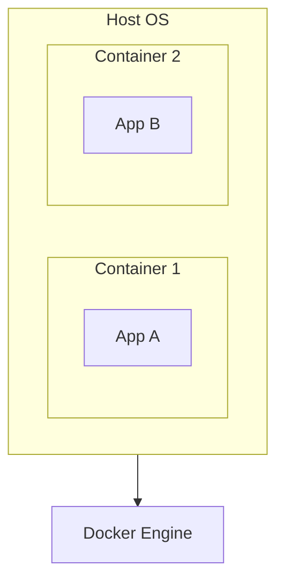
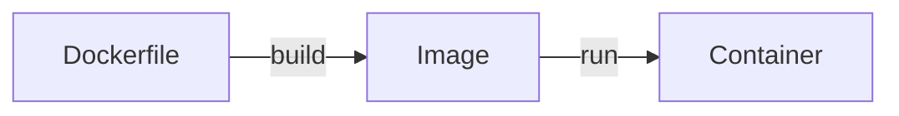
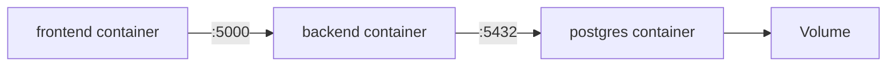

# Day 5 — Docker

**Sheet 5**

Containers, images, Dockerfile, and how they fit into our three-tier app.

---

## 1. Why Containers

- **Same environment** everywhere: dev, CI, prod.
- **Isolation** — app + dependencies in a box; no “works on my machine.”
- **Efficiency** — lighter than VMs; start fast.

---

## 2. Image vs Container

- **Image** — read-only template (layers: base OS, app, config).
- **Container** — running instance of an image.

---

## 3. Dockerfile Basics

- **FROM** — base image (e.g. `nginx:alpine`, `python:3.11-slim`).
- **COPY** — add files into the image.
- **RUN** — run commands during build.
- **EXPOSE** — document port (e.g. 80, 5000).
- **CMD** — command when container starts.

---

## 4. Volumes & Networking

- **Volumes** — persist data outside the container (e.g. DB data).
- **Networking** — containers can talk by name (e.g. `backend` → `postgres:5432`). Our frontend Nginx proxies to `http://backend:5000`.

---

## 5. Multi-Stage Builds (Brief)

- Use one stage to build (e.g. compile) and another to run — keeps final image small.

---

## 6. Demo: Our Three-Tier App

- Build: `docker build -t frontend ./app/frontend`, `docker build -t backend ./app/backend`.
- Run backend with env (DB_HOST, DB_PASSWORD, etc.) and Postgres; run frontend and proxy to backend.

---

## 7. Quick Recap

- Image = template; container = running instance.
- Dockerfile: FROM, COPY, RUN, EXPOSE, CMD.
- Volumes for data; container networking by name/port.

---

**Day 5 | Sheet 5** — *Ref: `app/frontend/`, `app/backend/`*
