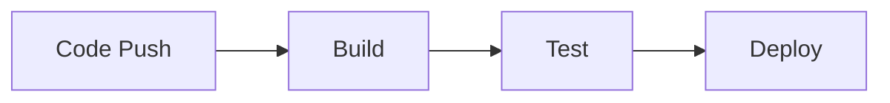
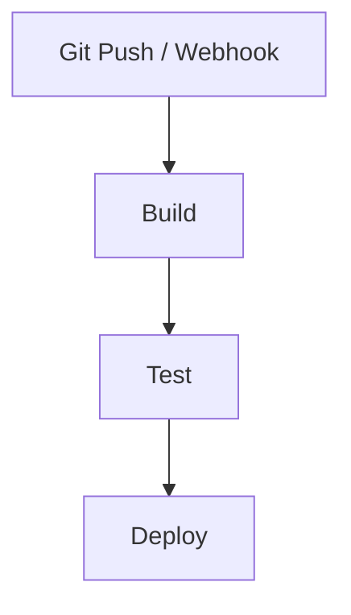

# Day 6 — CI/CD Concepts + Jenkins Demo

**Sheet 6**

What CI and CD are, and how a pipeline runs from code to deploy.

---

## 1. CI vs CD

- **CI (Continuous Integration):** Every commit triggers build + test. Catch breakage early.
- **CD (Continuous Delivery/Deployment):** Deliver (or deploy) to environments in an automated, repeatable way.

---

## 2. Pipeline Stages

- **Build** — compile / build images (e.g. Docker).
- **Test** — unit, lint, integration (optional).
- **Deploy** — push to registry, update K8s or runbooks.

---

## 3. Dev → QA → Prod

- **Dev** — feature branches; deploy to dev env.
- **QA** — merge to dev/main; deploy to test.
- **Prod** — release branch or tag; deploy with approval/gates.

---

## 4. Jenkins Demo

- **Job/Pipeline** — triggered by Git (webhook or poll).
- **Steps** — checkout, build (e.g. `docker build`), test, push image, deploy (e.g. kubectl/Helm).
- Use our **app/** as source; show one pipeline run end-to-end.

---

## 5. Quick Recap

- CI = build + test on every change; CD = automated delivery/deploy.
- Pipeline: Build → Test → Deploy; align with Dev/QA/Prod.

---

**Day 6 | Sheet 6** — *Ref: `app/` as pipeline source*
