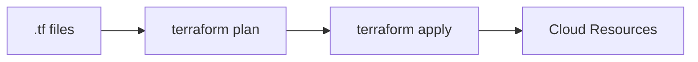
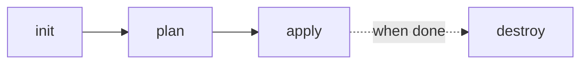

# Day 7 — Terraform Basics

**Sheet 7**

Infrastructure as Code: why it matters and the basic Terraform workflow.

---

## 1. What Is Infrastructure as Code (IaC)

- **Infra defined in code** (HCL) — VPC, subnets, EC2, security groups, etc.
- **Versioned and reviewable** — same as application code.
- **Repeatable** — same config gives same infra (dev/staging/prod).

---

## 2. Why Manual Console Is Risky

- No history, no review, easy to drift, hard to replicate. IaC gives **consistency and audit trail**.

---

## 3. Terraform Workflow

| Step | Command | Purpose |
|------|---------|---------|
| init | `terraform init` | Download provider, init backend |
| plan | `terraform plan` | Preview changes |
| apply | `terraform apply` | Create/update resources |
| destroy | `terraform destroy` | Tear down (when safe) |

---

## 4. State File

- **terraform.tfstate** — stores current resource IDs and attributes.
- Terraform uses it to know what exists and what to change/delete.
- **Keep it safe** — use remote backend (e.g. S3) and locking (e.g. DynamoDB) in real use.

---

## 5. Modules (Intro)

- **Module** — reusable set of resources (e.g. VPC, EC2). Our repo has `terraform/modules/vpc`.
- **Source** — `module "vpc" { source = "./modules/vpc" ... }`.

---

## 6. Demo

- From **terraform/modules/vpc**: `terraform init`, `terraform plan` (and optionally apply).
- Show VPC, subnets, security group in code and in plan output. Share one real production use case.

---

## 7. Quick Recap

- IaC = infra in code; Terraform: init → plan → apply (destroy to remove).
- State tracks reality; use remote backend in production. Modules for reuse.

---

**Day 7 | Sheet 7** — *Ref: `terraform/modules/vpc/`*
