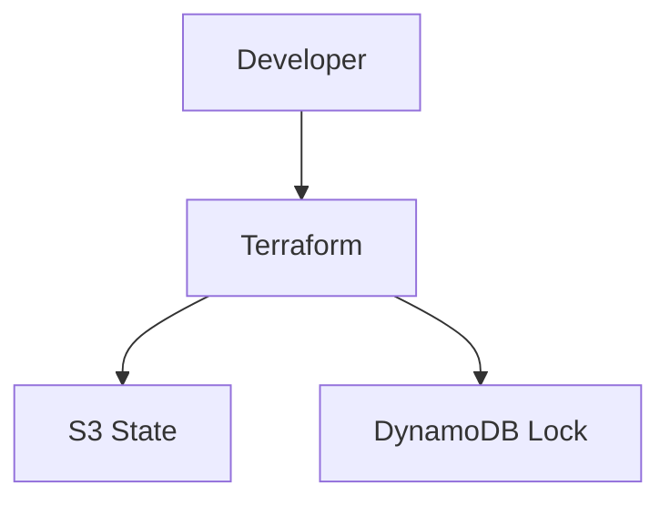
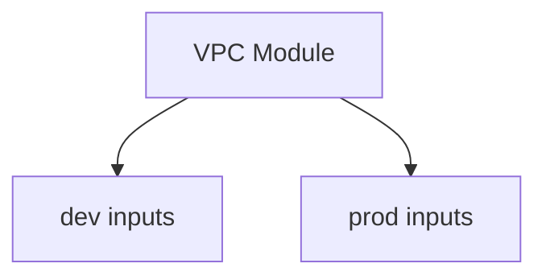

# Day 8 — Terraform Advanced (Practical)

**Sheet 8**

Remote state, variables, and dev vs prod separation.

---

## 1. Remote Backend (S3 + DynamoDB)

- **State in S3** — shared, durable; team can use same state.
- **DynamoDB** — lock table so two applies don’t run at once.

---

## 2. Variables & Outputs

- **Variables** — parameterize (e.g. `name_prefix`, `cidr_block`, `availability_zones`). Define in `variables.tf`, set in `terraform.tfvars` or CLI.
- **Outputs** — expose values (e.g. `vpc_id`, `subnet_ids`) for other modules or scripts.

---

## 3. Dev vs Prod Separation

- **Option A:** Separate directories (e.g. `envs/dev`, `envs/prod`) each with own tfvars/backend.
- **Option B:** Terragrunt — same module, different `terragrunt.hcl` per env with different inputs.

---

## 4. Terragrunt Demo

- **terragrunt/dev** and **terragrunt/prod** — same `terraform/modules/vpc`, different `name_prefix`, `cidr_block`, tags.
- Run `terragrunt plan` in dev; show how one module serves multiple environments.

---

## 5. Folder Structure Best Practices

- **modules/** — reusable (vpc, ec2, etc.).
- **envs/** or **terragrunt/<env>/** — per-environment config and state.

---

## 6. Quick Recap

- Remote state (S3) + lock (DynamoDB). Variables and outputs for flexibility.
- Dev/prod via separate configs or Terragrunt. Same module, different inputs.

---

**Day 8 | Sheet 8** — *Ref: `terragrunt/dev/`, `terragrunt/prod/`*
