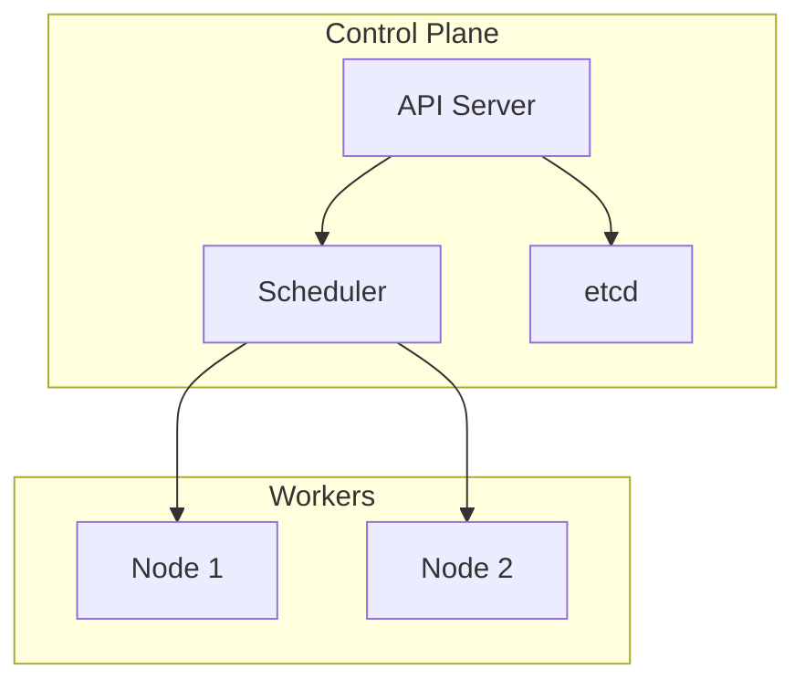
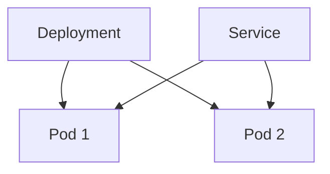

# Day 9 — Kubernetes Basics

**Sheet 9**

Control plane, workers, Pod, Deployment, Service, and basic YAML.

---

## 1. Architecture: Control Plane vs Workers

- **Control plane** — API server, scheduler, etcd, controller manager. Decides what runs where.
- **Workers (nodes)** — run your Pods. **etcd** — cluster state store.

---

## 2. Pod, Deployment, Service, Node

| Resource | Purpose |
|----------|---------|
| **Pod** | Smallest runnable unit; one or more containers. |
| **Deployment** | Manages Pods (replicas, rollout, rollback). |
| **Service** | Stable network identity; load-balance to Pods. |
| **Node** | Worker machine; Pods run on nodes. |

---

## 3. YAML Structure (Key Fields)

- **apiVersion, kind, metadata (name, namespace)** — identity.
- **spec** — desired state: for Deployment: `replicas`, `template` (container image, ports); for Service: `selector`, `ports`.

---

## 4. Demo

- Deploy Nginx from a single YAML (Deployment + Service).
- Open **manifests/frontend-deployment.yaml** and **backend-deployment.yaml** — same app as Docker, now as K8s resources.

---

## 5. Quick Recap

- Control plane + workers; etcd for state.
- Pod = runnable unit; Deployment = manage Pods; Service = network to Pods.
- YAML: apiVersion, kind, metadata, spec.

---

**Day 9 | Sheet 9** — *Ref: `manifests/`*
