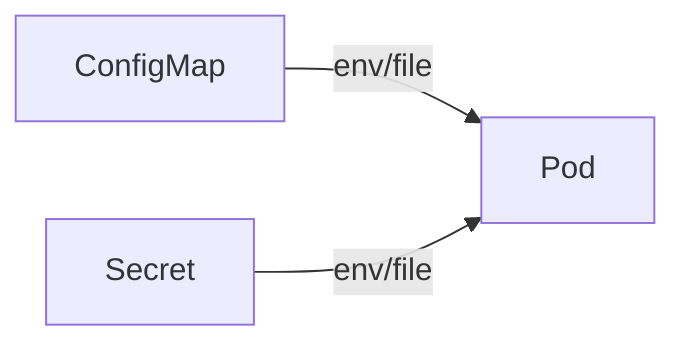
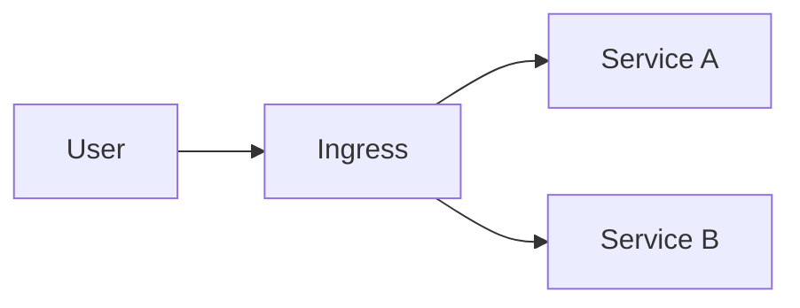

# Day 10 — Kubernetes Advanced

**Sheet 10**

ConfigMap, Secret, Ingress, rolling updates, and HPA.

---

## 1. ConfigMap & Secret

- **ConfigMap** — non-sensitive config (e.g. DB_HOST, DB_PORT). Mount as env or file.
- **Secret** — sensitive data (passwords, keys). Same idea; base64 in YAML, use sealed-secrets or external secret ops in production.

---

## 2. Ingress

- **Ingress** — HTTP(S) routing into the cluster (host/path → Service).
- **Ingress controller** — e.g. nginx-ingress; implements Ingress and does TLS termination.

---

## 3. Rolling Updates

- **Deployment** — change image or spec; K8s rolls out new Pods and terminates old ones gradually.
- **Rollback** — `kubectl rollout undo deployment/<name>`.

---

## 4. HPA (Horizontal Pod Autoscaler)

- Scale number of Pods by **CPU** (or custom metrics). Min/max replicas; target utilization %.

---

## 5. Demo

- Apply full stack from **manifests/**: namespace, DB, backend, frontend, ingress. Show ConfigMap and Secret in use; optional: change ConfigMap and rollout restart.

---

## 6. Quick Recap

- ConfigMap = config; Secret = sensitive data. Ingress = HTTP routing; controller does TLS.
- Rolling update via Deployment; HPA for auto-scaling.

---

**Day 10 | Sheet 10** — *Ref: `manifests/`*
