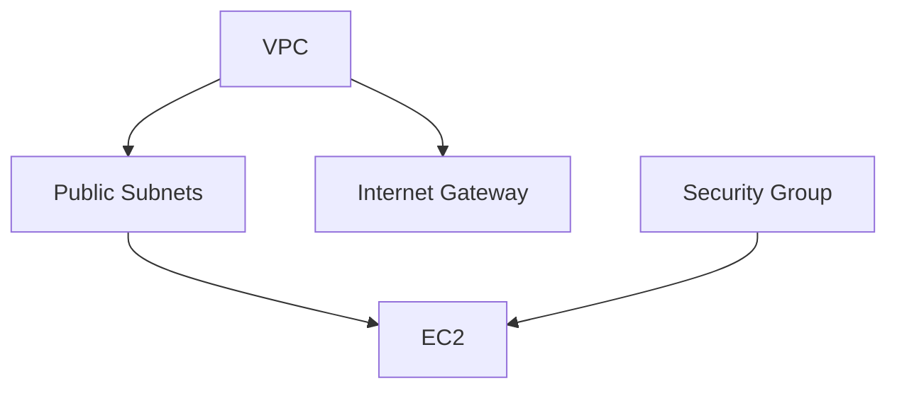

# Day 11 — AWS Architecture Overview

**Sheet 11**

VPC, IAM, EC2, security groups, and load balancer — and how Terraform created them.

---

## 1. Core Building Blocks

| Component | Purpose |
|-----------|---------|
| **VPC** | Isolated network; CIDR block (e.g. 10.0.0.0/16). |
| **Subnets** | Segments inside VPC (e.g. public/private per AZ). |
| **Internet Gateway** | Connect VPC to the internet. |
| **Security Group** | Firewall: allow/deny by port and source. |
| **IAM** | Who can do what (users, roles, policies). |
| **EC2** | Virtual servers. |
| **Load Balancer** | Distribute traffic (ALB/NLB). |

---

## 2. How This Ties to Terraform

- Our **terraform/modules/vpc** creates: VPC, IGW, public subnets, route table, security group (SSH + HTTP).
- Day 7/8 we ran it; here we **map** those resources to AWS concepts and console (or Terraform state).

---

## 3. IAM Best Practices (Preview)

- Least privilege; roles for services (e.g. EC2 role); avoid long-lived access keys when possible. (Day 14 goes deeper.)

---

## 4. Quick Recap

- VPC → subnets → IGW; security groups for access; IAM for identity.
- Our Terraform VPC module provisions this; same design for dev/prod with different inputs.

---

**Day 11 | Sheet 11** — *Ref: `terraform/modules/vpc/`, AWS console*
