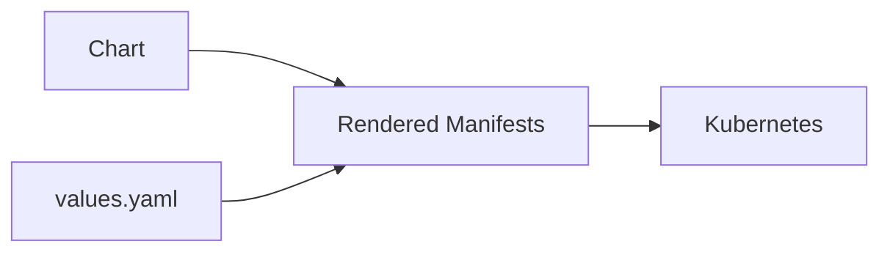
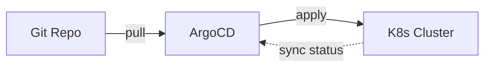

# Day 12 — Helm + GitOps (Short & Practical)

**Sheet 12**

Helm for templating and packaging; GitOps (Git as source of truth) and ArgoCD.

---

## 1. Why Helm

- **Charts** — package (templates + default values) for K8s apps.
- **values.yaml** — one place to change replicas, image, env; templates generate final YAML.
- **Upgrade/rollback** — `helm upgrade`, `helm rollback`. Same app, many environments.

---

## 2. values.yaml

- Override image tag, replica count, ingress host, DB auth, resource limits. One set of templates, many configs (dev/staging/prod).

---

## 3. GitOps Concept

- **Git = source of truth** — desired state in repo (manifests or Helm values).
- **Controller** (e.g. ArgoCD) — watches Git and applies changes to the cluster. Drift is corrected by reapplying from Git.

---

## 4. Blue–Green Idea

- Two identical environments (blue = current, green = new). Switch traffic to green after validation; roll back by switching to blue.

---

## 5. Demo

- From **helm/three-tier-app**: show `values.yaml` and one template. `helm install` (or upgrade). Compare with raw manifests — same app, one command. Optional: point to real EKS + Argo if you use it.

---

## 6. Quick Recap

- Helm = chart + values → rendered manifests; upgrade/rollback.
- GitOps = Git as truth; ArgoCD syncs cluster to Git. Blue–green = two envs, switch traffic.

---

**Day 12 | Sheet 12** — *Ref: `helm/three-tier-app/`*
