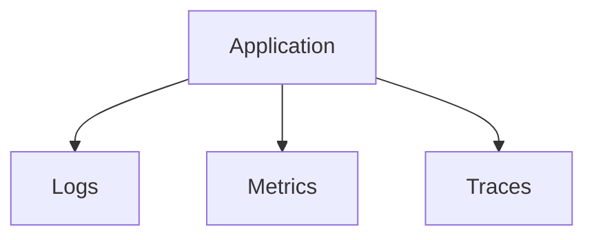
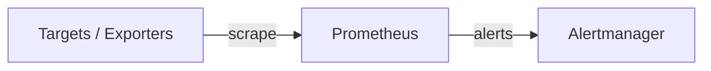

# Day 13 — Monitoring & Logging

**Sheet 13**

Logs vs metrics vs traces; Prometheus, Grafana, and centralized logging.

---

## 1. Logs vs Metrics vs Traces

| Type | What it is | Example |
|------|------------|---------|
| **Logs** | Event/line-oriented (errors, requests). | "ERROR connection refused" |
| **Metrics** | Numbers over time (counters, gauges). | requests/sec, CPU % |
| **Traces** | Request path across services. | trace-id: A → B → C |

---

## 2. Prometheus

- **Scrape** — pull metrics from targets (HTTP endpoint).
- **Store** — time-series DB.
- **Alert** — rules → Alertmanager → notify (Slack, PagerDuty, etc.).

---

## 3. Grafana

- **Dashboards** — visualize Prometheus (and other) data. Graphs, tables, panels.
- **Demo:** Show one dashboard (e.g. CPU, request rate, errors).

---

## 4. Centralized Logging (ELK or Similar)

- **Flow:** App → log shipper (e.g. Fluentd) or sidecar → store (Elasticsearch) → search/visualize (Kibana). Concept: one place to search all logs.

---

## 5. Quick Recap

- Logs = events; metrics = numbers; traces = request flow.
- Prometheus = scrape + store + alert; Grafana = dashboards. Centralized logging = ship logs to one store and query.

---

**Day 13 | Sheet 13**
