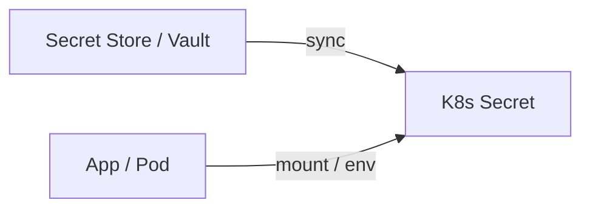

# Day 14 — DevOps Security + Production Thinking

**Sheet 14**

IAM, secrets, TLS, and incident mindset.

---

## 1. IAM Best Practices

- **Least privilege** — only permissions needed.
- **Roles for services** — EC2 role, pod identity; avoid hardcoded keys.
- **Rotate** — credentials and keys; automate where possible.

---

## 2. Secrets Management

- **Never in code or Git** — use env vars from a secure source, or K8s Secrets / external secret operator (e.g. Vault).
- Our three-tier app: **Secrets** for DB password; ConfigMap for non-sensitive config.

---

## 3. TLS/SSL Basics

- **HTTPS** = HTTP + TLS. Certificates (public/private key); termination at LB or Ingress. DevOps: cert renewal (e.g. cert-manager), strong ciphers.

---

## 4. Vault Intro (If You Use It)

- **Vault** — store and generate secrets; dynamic DB creds, API keys. Integrate with K8s (e.g. ESO, CSI driver).

---

## 5. Common Failures & Incident Mindset

- **What can go wrong:** misconfig, secret leak, overload, dependency down.
- **Who gets paged, how we debug:** logs, metrics, traces; runbooks; blameless postmortems.

---

## 6. Quick Recap

- IAM: least privilege, roles, rotation. Secrets: never in Git; use secret store or K8s Secrets.
- TLS for HTTPS; think “what breaks and how do we respond.”

---

**Day 14 | Sheet 14** — *Ref: `manifests/*secret*`, Helm secret templates*
