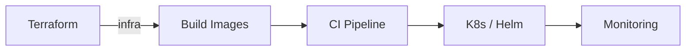

# Day 15 — Final Capstone + Career Masterclass

**Sheet 15**

End-to-end deploy and career guidance.

---

## 1. Capstone: Full Stack in One Flow

Deploy the three-tier app the “DevOps way” in one narrative:

- **Terraform** — VPC (or cluster) if needed.
- **Build** — Docker images for frontend, backend.
- **CI** — pipeline builds, tests, pushes images.
- **K8s/Helm** — deploy with `helm install` from **helm/three-tier-app**.
- **Monitoring** — point to one dashboard (e.g. Grafana).

Use **this repo only**: app, Terraform/Terragrunt, manifests, Helm.

---

## 2. Resume Tips

- **What recruiters look for:** tools (K8s, Terraform, CI/CD), impact (reduced outages, faster releases), ownership.
- **Format:** clear sections (skills, experience, projects); quantify where possible. No fake experience.

---

## 3. Interview Scenarios

- **Scenario questions:** “How would you debug a slow API?” “How do you roll out with zero downtime?” “How do you manage secrets?”
- **Answer pattern:** understand → gather (logs, metrics) → fix or mitigate → prevent (alerts, runbooks).

---

## 4. Three-Year Roadmap

- **Year 1:** Deepen one cloud + K8s + one CI/CD; own one pipeline or service.
- **Year 2:** Multi-env, cost/security, mentoring.
- **Year 3:** Design systems, lead initiatives, architect. (Growth from 5 LPA → 20+ LPA with skills + impact + job moves.)

---

## 5. Quick Recap

- Capstone = Terraform → build → CI → Helm → monitoring, all from this repo.
- Resume: impact + tools. Interviews: scenario + structure. Roadmap: deepen → own → lead.

---

**Day 15 | Sheet 15** — *Ref: full repo — app, terraform, terragrunt, manifests, helm*
